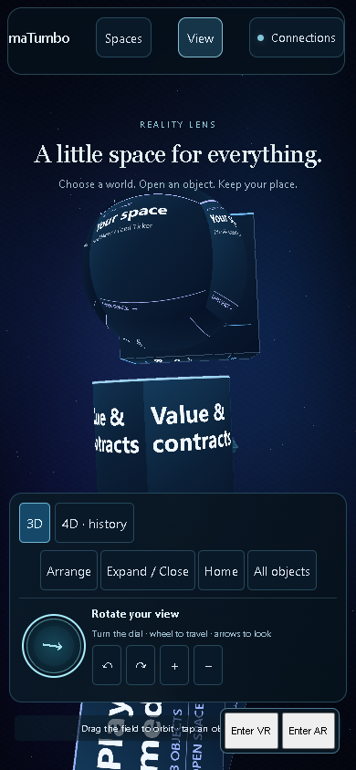
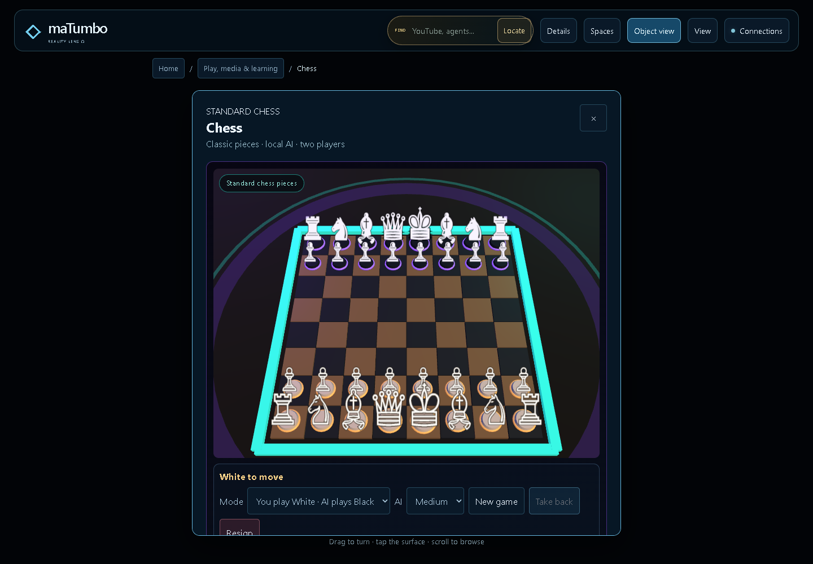
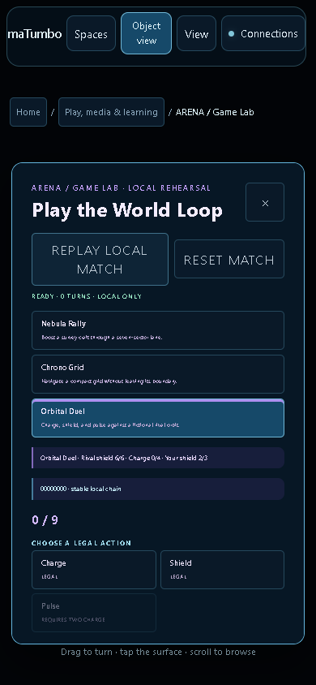

# Feature completion acceptance

## Current recheck — October 7, 2026

The current 36-route, cross-feature workflow, My GPT, JavaScript and Python
results are recorded in the [October 7 feature audit](CURRENT_FEATURE_AUDIT_2026-10-07.md)
with fresh machine-readable browser evidence. The older counts below describe
the October 4 acceptance run.

The October 4 completion pass covers every registered route and repairs the
missing local workflows behind those routes. The [36-route matrix](../FEATURE_COMPLETION.md)
records the owning engine, evidence and service/device limits for each space.
The work continues on `fix/reality-lens-calm-2026-10-03`. The commit
`e5f394eeb5f517cd96ab59d543ece789daa88e2b` identifies the October 4
acceptance snapshot; the October 7 audit records the current source and fresh
browser evidence.

## Verified behavior

- Rooms now creates local spaces, enters/leaves membership, saves literal text
  messages, retains history on reload and merges validated backups. Observer
  rooms are read-only. Canonical room/cipher projections retain metadata only.
- Arena has a reachable Orbital victory and replays the complete bounded event
  chain. Chess retains legal history, recognizes repetition and terminal draws,
  and cancels pending AI/animations when restoring a human turn.
- Academy completes its lesson path and reconstructs progress from actual
  answers, including records beyond the visible trace window.
- NFT collections, outfits and manual contract journals now save locally and
  have validated export/import controls. Capacity is checked before mutation;
  stale tabs cannot silently replace newer saves. Contract reset preserves the
  separate approved outcome desk and its awards.
- The Ourplace lender can review a matured loan using the existing engine.
  Explicit rehearsal clock steps do not bypass deadline or fresh-oracle guards.
- Lens Guide and Plan Helper load through trusted bundled factories with no
  approved action powers. Resting preferences survive reload. Version changes
  do not inherit prior capability approval. Session callbacks are labelled.
- The optional View dial rotates the actual camera, supports keyboard controls,
  and bounds wheel travel. Route identity remains intact. Shared observations
  identify all mounted owners and expose GPT readiness without private content.
- Authored source contributions refresh the shared projection. White Paper
  receives the correct envelope and composes its live sections. Saved mapped
  outfits retry after Person restoration; fresh defaults do not replace an
  existing saved Person preference.

## Browser evidence

The final browser runs used Chromium, software WebGL and isolated test storage.
Desktop was 1440 × 1000; phone was 390 × 844. These are viewport checks, not
physical-phone, GPU-performance or headset acceptance.

| Evidence | Result | What it proves |
| --- | --- | --- |
| [Final route inventory](feature-completion/route-inventory.json) | 72/72 | All 36 routes on both viewports; current observation owner open; one canonical mesh surface owner where applicable; no page errors or horizontal overflow. |
| [Final cross-section workflows](feature-completion/browser-workflows.json) | 32/32 | Rooms lifecycle and download; actual dial movement; Muse save/apply/reload; bundled plugin replies/restoration; shared NFT projection updates; private GPT readiness; Luna handoff; saved Wardrobe/Person restore; migration, neural, social, gesture and document navigation. |
| [Games workflows](feature-completion/games-browser.json) | 10/10 | Actual 3D chess selection/move, AI and takeback; all Academy lessons; the exact 42-event Orbital victory and replay on both viewports. |
| [Wardrobe workflows](feature-completion/wardrobe-browser.json) | 13/13 | Actual creation/equip/save/reload/download/import, starter mapping and malformed-import preservation. Stale-tab check uses the original component on the same loopback origin. |
| [Economic authoring](economy-completion-browser.json) | 24/24 | NFT and manual-contract native forms, downloads, durable reload, import rejection, stakes and resolution on desktop/phone. |
| [Loan maturity](economy-loan-maturity-browser.json) | 5/5 | Finite funding/collateral, disabled premature review, explicit clock advance, zero-effects stale-oracle denial and conserved fresh-fixture liquidation on phone. |

The route and cross-section JSON reports contain SHA-256 hashes of every source
file before and after each run; both record `sourceUnchanged: true`. The final
cross-section run ended at `2026-10-04T16:54:11.860Z`; the route run ended at
`2026-10-04T16:55:56.614Z`. The 84 interaction checks above are separate from the
72 route/layout checks. Original feature controls are exercised in Text view;
the chess checks use the actual 3D board. This does not claim each form was
clicked on every rotated geometry face.

The parent workspace retains downloaded fixture backups, full logs, scripts and
failed harness attempts in `outputs/app-completion/` and
`outputs/feature-completion/`. Earlier attempts incorrectly assumed a newly
created room still needed Enter, overlooked Migration's deliberate Block World
handoff, treated a gesture counter as an array and looked for a Person mapping
field omitted from the compact outfit snapshot. Corrected assertions test the
advertised behavior. Wardrobe's second full-app stale-tab attempts timed out
under software WebGL; the narrower component check is labelled explicitly.

## Complete suite and reproduction

The current local JavaScript suite passes **2,656/2,656 tests across 113 suites**
with no skips. The current Python bridge/package suite passes **80/80 tests**.
An old release check prohibited all room persistence; it now allows the
requested local room owner while retaining network, wallet and authority bans,
including the new conversation renderer. The first full run's one obsolete
assertion and its log remain distinguishable from the final passing result.

From the checkout, with Node on PATH and Python available:

```powershell
node --check src/main.js
py -3 scripts/run_tests.py
py -3 -m unittest discover -s tests -p 'test_*.py'
.\scripts\verify-demo-launch.ps1 -StaticPort 8082
```

The standalone browser scripts are
`scripts/verify-feature-routes.cjs` and `scripts/verify-feature-workflows.cjs`.
They need a Playwright installation and its Chromium browser. On this verified
workspace, select the existing bundled runtime:

```powershell
$env:PATH = 'C:\Users\carlg\.cache\codex-runtimes\codex-primary-runtime\dependencies\node\bin;' + $env:PATH
$env:PLAYWRIGHT_MODULE = 'C:\Users\carlg\.cache\codex-runtimes\codex-primary-runtime\dependencies\node\node_modules\playwright'
node scripts/verify-feature-workflows.cjs
node scripts/verify-feature-routes.cjs
```

Run browser scripts sequentially. Their default target is
`http://127.0.0.1:8082/`; `FEATURE_COMPLETION_BASE_URL` can select another local
listener and `FEATURE_COMPLETION_OUTPUT` can select an output directory. Default
reports go to ignored `work/feature-completion/` paths, preserving committed
acceptance artifacts.

## Runtime and external limits

The verified loopback listener is PID 25180, created at
`2026-10-07T12:16:20.0045970Z`, serving this checkout through
`scripts/provider_bridge.py --port 8082`. Its instance ID is
`41cc5b40514a4c9d82d84f5d96a1e0c6`; health reports 36 features. GPT status reports
ChatGPT `signed_out`, authentication dependencies available, OpenAI `key_needed`
and credential storage `windows_dpapi`. NVIDIA remains `key_needed`.

Real GPT replies require the owner's explicit account connection or secure API
configuration. Saved GPT links and selected history do not synchronize private
ChatGPT internals. Merge 4 live sync requires its separately running service.
Remote room delivery/encryption, network multiplayer, external financial
execution and physical XR/hand tracking are not connected by these local engine
repairs. Public readers/embeds remain dependent on their actual provider state.
Earlier GPT and native-media evidence stays tied to its recorded revision.

This acceptance records local source/workflow evidence. Exact pushed-commit CI
is checked separately. The PR remains draft and unmerged; no public deployment
is claimed.

## Screenshots






