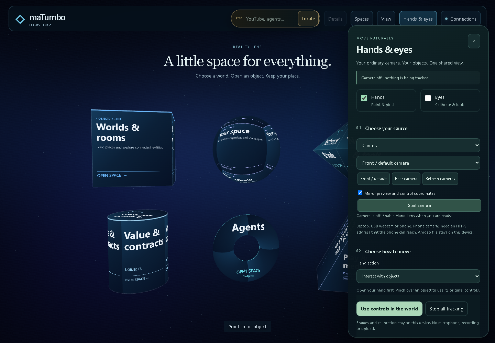
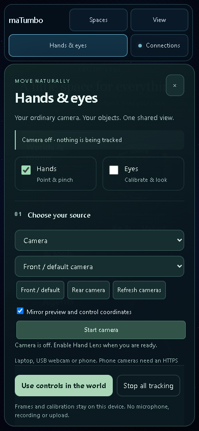
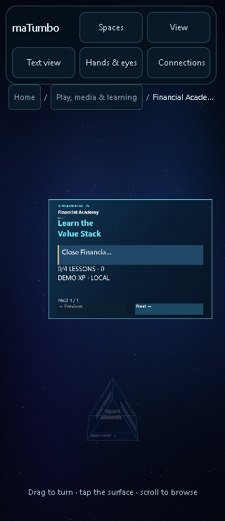

# Hands, eyes and camera input acceptance

Validated 2026-10-05 on branch `fix/reality-lens-calm-2026-10-03`, continuing source base `54b08bb6c1d3e29f88272cef6f19b15d7faafd93`. [Exact accepted source fingerprints](hands-eyes/source-fingerprints.json) identify this change independently of its containing commit. [User guide](../HANDS_AND_EYES.md).

## Delivered behavior

- One Hands & eyes drawer in the original Home/feature header, also reachable from Gesture Lens and Phone Gestures. The original camera panel and video element move into that drawer. No camera starts on page load or when opening settings.
- Default/laptop camera, ephemeral USB/device selection, explicit rear camera request, mirror control, and local video playback. Source replacement, permission denial, mute, pause, end, startup deadlines and cancellation have visible states and cleanup.
- Real MediaPipe hand and face detectors in separate bounded workers, fed by one video source. Pinned runtime/model files load from the same origin; SHA256 provenance is tested in CI. GPU failure has a CPU path; the slower workerless hand fallback is labeled.
- Original Home meshes, feature meshes and mounted 360-degree surface controls receive hand input through their existing owners. Pinch/open arming, held-hand loss cancellation, stale-result rejection, malformed-landmark rejection and duplicate-handedness rejection prevent accidental releases.
- Arrange previews translation, two-hand scale and roll; release commits through original layout owners. Loss cancels. Feature transform commits are atomic and respect history/locks. Home layout persists in this browser, with an explicit reset.
- Original Home/space breadcrumbs, Back, paging, Spaces and catalog headers accept hand navigation. View and Text/Object view require pinch. Only exact registered navigation elements accept these native clicks; other foreground controls obstruct underlying objects.
- Empirical gaze calibration uses nine training and five separate validation targets. Stable fresh samples, coverage, fit conditioning and error limits gate activation. Source/mirror/dimensions/viewport changes invalidate calibration. Gaze-only dwell is optional and navigation-only; look-then-pinch requires hand confirmation.
- Local recordings remain observation-only until replay is explicitly armed, including outside Assembly. Calibration, landmarks, frames and private camera identifiers are not persisted or uploaded.

## Evidence and limits

| Check | Result | Evidence |
| --- | --- | --- |
| Complete JavaScript suite | 2,545 passed, 113 suites, zero failures/skips | [Test output](hands-eyes/hands-eyes-final-js.txt) |
| Complete Python suite | 73 passed, including deterministic extracted package and bridge tests | [Test output](hands-eyes/hands-eyes-final-python.txt) |
| Full-app object interactions | 9 passed: arming, jitter, loss, reacquisition, transforms, original Academy UV action | [Synthetic mounted-hand traces](hands-eyes/hands-eyes-routing-check.json) |
| Full-app navigation | 30 passed: 15 desktop and 15 phone viewport checks | [Compact summary](hands-eyes/hands-eyes-navigation-summary.json), [full traces](hands-eyes/hands-eyes-navigation-check.json) |
| Current drawer/layout | Desktop 1440x1000, phone 390x844 and narrow phone 320x740; denied-permission handling, no autostart, all six Home hits, fitting feature headers; zero page errors | [Browser result](hands-eyes/hands-eyes-app-check.json) |
| Real hand model | Actual 21-point detections from locally decoded official sample video; changing pixels while drawer hidden; pause/resume/end and URL release | [Model/video result](hands-eyes/hand-positive-video-check.json) |
| Real face model | Actual 478-point face, finite iris points, valid eye geometry, no uncalibrated gaze; face loss clears output | [Face result](hands-eyes/eye-positive-face-check.json) |
| Both real models in full app | 50 decoded frames, one video element, positive hand frames and eye geometry, both workers, replay disabled, clean Stop | [Shared-source result](hands-eyes/hands-eyes-shared-source-check.json) |
| Invalid hand observations | Original NaN reproduction now cancels rather than releasing; duplicate labels rejected; recovery must reopen | [Regression summary](hands-eyes/hand-session-validation-summary.json) |

The full-app interaction tests inject explicitly synthetic landmarks through the mounted session. The two gaze navigation checks invoke the public adapter with armed gaze; they do not measure a person's gaze. Production-model probes use official public hand/portrait fixtures, not the user's camera. All browser contexts were closed; no physical camera was accessed. Tumbo reported that the physical camera test had not yet been tried.

The navigation fixture waits for 16 open samples after large pointer jumps to settle the existing recognizer smoothing. Original seven-pixel drag safeguards were preserved. This evidence establishes these tested workflows, not universal accuracy under lighting changes or on every camera/browser.

The final static build contains 722 files, including the workers, WASM and model bundles. The complete Python suite verifies reproducible archive bytes and extracted asset integrity. The live loopback bridge serves this checkout at port 8082, instance `461342cfd3864d8b9728a6a9667f02db`. Phone camera use requires a reachable HTTPS deployment. This change is not evidence of a merge or public deployment; the draft PR remains separate from GitHub Pages main.

## Rendered interface







## Reproduce

```powershell
python scripts/run_tests.py
python -m unittest discover -s tests -p "test_*.py"
node --test tests/vision-assets.test.mjs
python scripts/build_pages.py <new-empty-output-directory>
```

The browser harnesses and public-fixture provenance are retained under the local ignored `work/` directory. Read-only acceptance data and screenshots above are checked in. No account login, authenticated model reply, external messaging or financial execution is part of this change.
