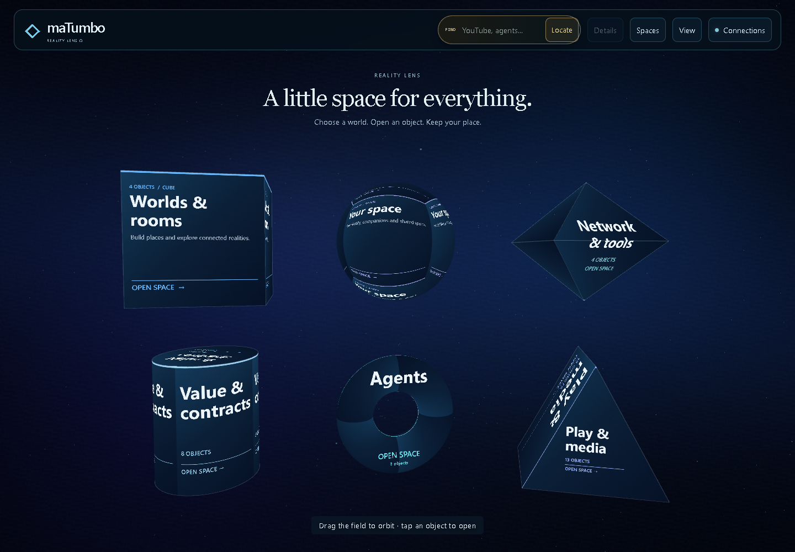
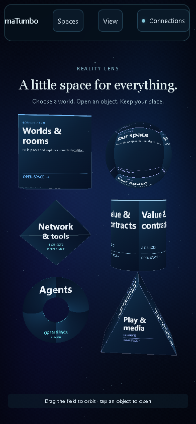

# Six distinct Home bodies

The subsequent [Network polish](NETWORK_TOOLS_ACCEPTANCE.md) repairs side-face lettering and refines the tool space. This record retains the original diamond replacement evidence.

Network & tools now uses a closed eight-faced diamond (octahedron), replacing the second Home cube. Worlds & rooms retains the cube. The other spaces retain their sphere, cylinder, torus and triangular prism. The six spaces keep their existing features and canonical navigation.

The diamond title is painted across its actual front/rear facets. The whole body opens Network & tools through triangle picking; empty silhouette corners cannot act as a square button. The broad front facets keep Network readable at desktop and phone sizes. Existing Network feature defaults and saved shapes are retained. Diamond also becomes an optional supported feature form through the shared registry.

## Verification of this change

- **110/110 focused JavaScript tests** across ten files pass, with zero failures or skips. Geometry closure, outward winding, every diamond facet, empty silhouette corners, original-control routing, scene bounds and shape serialization are covered. The same tests cover the ten supported forms.
- **12/12 browser checks** pass across fresh desktop 1440 x 1000 and phone 390 x 844 contexts. Every Home vertex fits, the torus hole rejects taps, physical diamond taps enter Network, a physical Gateway feature tap opens its original owner, and breadcrumbs, Back/Forward, cold reload and Home preserve canonical routes. No page errors or horizontal overflow.
- An independent read-only source/diff review found no blocking issue. The reviewer did not independently execute these tests.

[Acceptance record and source hashes](home-diamond-acceptance.json) · [Physical navigation trace](home-diamond-navigation.json) · [Engine and controls](../REALITY_SURFACES_360.md)

These are software-WebGL and phone-viewport checks. The previous full-suite, native-media and package records retain commit a9b7665 and their original scope; they are not relabeled as tests of the diamond follow-up. Its existing ZIP/TAR downloads do not include this Home change. This follow-up is local/draft PR work; no merge or public deployment occurred.
