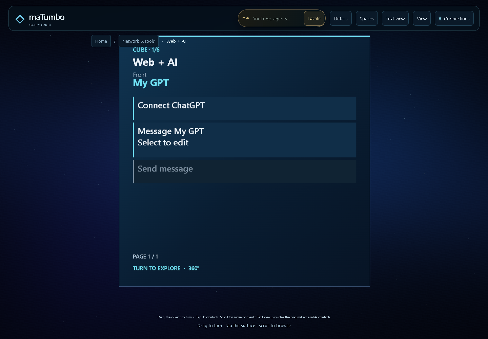
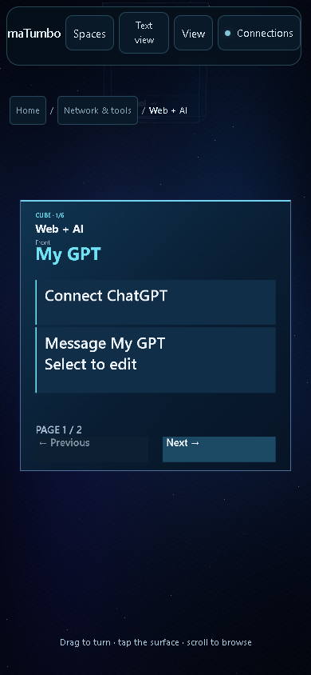
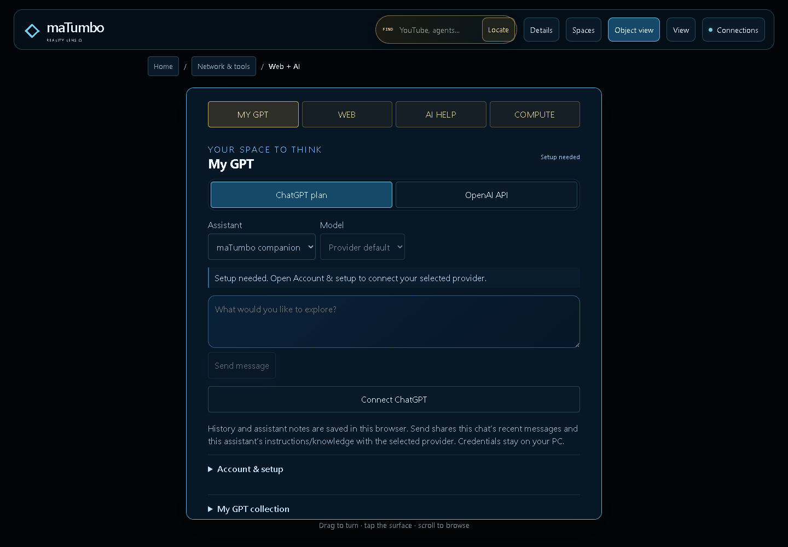
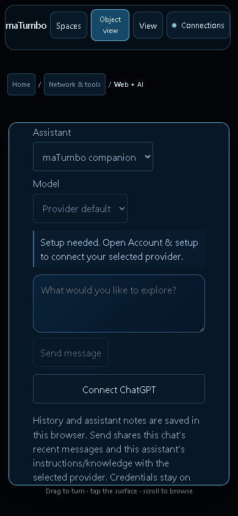

# My GPT integration acceptance

My GPT is part of the existing **Network & tools → Web + AI** object. The original DOM owns chat, assistant profiles, history and settings; the object paints and activates those same controls. WEB, AI HELP and COMPUTE remain available. No new feature owner or separate world was introduced.

## Implemented behavior

- Local ChatGPT plan connection through the documented public OAuth/Responses flow, with explicit plan permission, account registration, model discovery, renewable sessions and disconnect. API-key access is a separate server-side option with separate billing.
- Visible distinction between signed out, signed in, configured but untested, and a completed response. A missing account or model disables Send. Requests carry the displayed ChatGPT account ID so a different tab cannot silently switch their account.
- Saved GPT links and up to 12 local assistant profiles with supplied instructions/knowledge. GPT links open the original GPT on ChatGPT; they do not import or invoke a hosted custom GPT's internals.
- Local conversation history, selected-branch ChatGPT JSON import, portable JSON export and explicit history clearing. Only a selected conversation's bounded recent context is sent after Send. Tools, hidden analysis and attachments are excluded from imports.
- Guarded persistence detects stale tabs and retains their unsaved work for export. Recovery imports preserve divergent conversations and assistant configurations; repeated imports are idempotent. This is optimistic conflict detection, not an atomic cross-tab storage transaction.
- Credentials remain outside the repository/browser. Windows uses current-user DPAPI; alternate platforms use owner-only storage. The exact loopback origin and custom request header gate mutations. OAuth state/PKCE/nonce/JWT checks, fixed upstream destinations, bounded output and refresh locking are exercised by tests.
- First-face setup and composer controls work on desktop and phone viewports. Opening My GPT focuses its heading without opening a floating textarea editor. Focus alignment uses the camera viewing plane so a travelling camera cannot leave the front facing away; deliberate object rotation is preserved.
- Text view uses the original controls with one outer scroll area, a compact section switcher, and object settings after the feature's content. The launcher repairs fractional timestamp comparisons while retaining all process ownership checks.

## Recorded checks

Local complete-suite verification: **2327 JavaScript tests across 104 suites** and **59 Python tests**, all passing. The Python count includes 39 GPT tests, 19 existing provider tests and the deterministic extracted-package test. Launcher process checks pass in Windows PowerShell 5 and PowerShell 7.6.5. No tests are skipped locally. CI status belongs to the pushed commit and is reported separately in the PR.

The final Playwright replay passes **16 checks**, eight each at 1440×1000 and 390×844. It proves the signed-out live bridge status, one original object owner, no automatic editor/inference, a physical triangle-mapped setup click, assistant creation, selected-branch import, a real downloaded JSON export, selection/history persistence through reload, disconnected Send gating, and absence of page errors/horizontal overflow. The final Send/reply check uses an explicitly intercepted transport fixture and verifies the selected context and account in the request. It does **not** establish a live OpenAI reply.

[Browser evidence](my-gpt/browser-acceptance.json) · [Checked source hashes](my-gpt/source-hashes.json) · [Use and setup guide](../MY_GPT.md)

| Desktop object | Phone object |
| --- | --- |
|  |  |

| Desktop Text view | Phone Text view |
| --- | --- |
|  |  |

## Observed account and release state

The owned local bridge at port 8082 reports ChatGPT `signed_out`, authentication dependencies `ready`, API `key_needed`, and credential storage `windows_dpapi`. No owner sign-in or live authenticated inference has been performed. The OpenAI Developers secure API-key setup connector returned **“This app connection requires reauthentication. Reconnect the app and try again.”** No API key was provisioned, exposed or saved.

The owner must complete OpenAI's consent page before real ChatGPT plan inference can be verified. Sign-in does not synchronize website conversations or custom GPT definitions. The static GitHub Pages build contains the UI/local collection but cannot host the loopback credential service. Software WebGL and phone viewport checks do not establish physical-phone or XR acceptance. Existing downloadable packages retain their earlier source identity. This change remains in draft PR #70; no merge or public deployment was performed.
