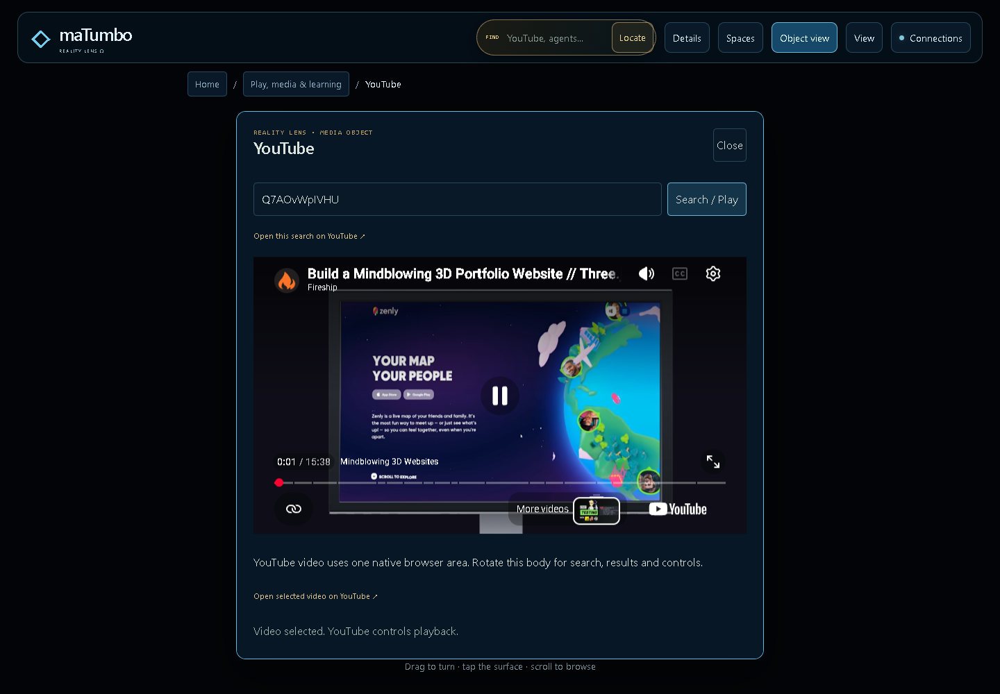
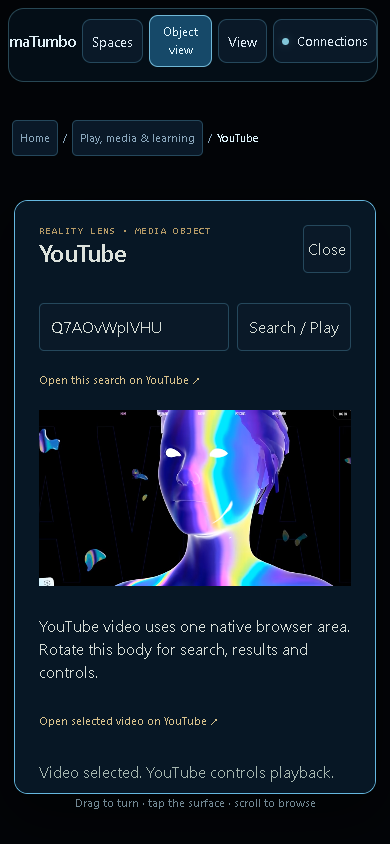

# Native media and readable Text view

Text view previously overlapped the painted body, and the native YouTube player could stay hidden outside the original document's reading flow. This repair gives the original owner an opaque reading surface below the navigation, hides the painted world in that mode, and places the one mounted iframe in its reserved reading slot.

The iframe enters its stable CSS3D parent while blank, before play. Deliberate video selection enables eager loading. View changes, scrolling, shapes and phone resizing change projection coordinates without moving or replacing the iframe, its browsing context or its source. Native layout also responds while the world freeze guard pauses expensive rendering.

## Verified behavior

- A real public YouTube video, `Q7AOvWpIVHU`, played through the original native form. Its identity came from the earlier live search result; no fake provider response or video stream was used.
- The extended diagnostic observed playback from approximately 3.6 to 33.6 seconds, `readyState=4`, no media error and HTTP 200 media responses.
- In the frozen-source continuity run, desktop playback advanced from 1.62 to 11.43 seconds. Phone playback continued from 12.36 to 22.08 seconds. Both remained unpaused with decoded video available.
- Both viewports retained the exact original iframe and `contentWindow`, one player and one semantic owner through Text/Object switching and all five shape changes. Playback time did not reset.
- All four corners of the displayed player matched its native reading slot within 1.5 pixels, including after scrolling. The reading owner had an opaque background, the painted world was hidden and neither viewport overflowed horizontally. No page errors were observed.
- Three mathematical regressions verify screen corners under a rotated/scaled owner, perspective zoom and invalid-slot rejection. These establish placement contracts; rendered browser checks establish the real DOM behavior.
- The complete local suite passes **2,292 JavaScript tests and 20 Python tests** with no failures or skips and unchanged source hashes. A fresh body interaction replay also passes **20 mouse/keyboard checks** across desktop and phone, including all five forms, native editing, rotation, checkbox input and the original chess e2–e4 move.

[Machine-readable browser evidence](native-media-acceptance.json)

## Verification boundaries

These checks use Chromium software WebGL at 1440 × 1000 and 390 × 844. They do not establish physical phone, hardware GPU or XR behavior. The player remains a planar native browser area because cross-origin iframe pixels cannot be painted into curved mesh materials. This proves successful playback for one tested public video under the observed network conditions; regional, age, embedding and provider restrictions can differ for other videos.

Earlier failed continuity attempts remain in local evidence: one captured the blank frame's browsing context before the first CSS3D mount, another waited for a player parent that could not exist while the blank object was hidden, and the scroll check exposed a real projection update gap. The stable blank mount and event-driven native layout address the product issues. The final run records unchanged source hashes and passes both viewports.

NVIDIA still requires an owner-provided server key. This repair does not merge the draft PR or deploy the public site.
