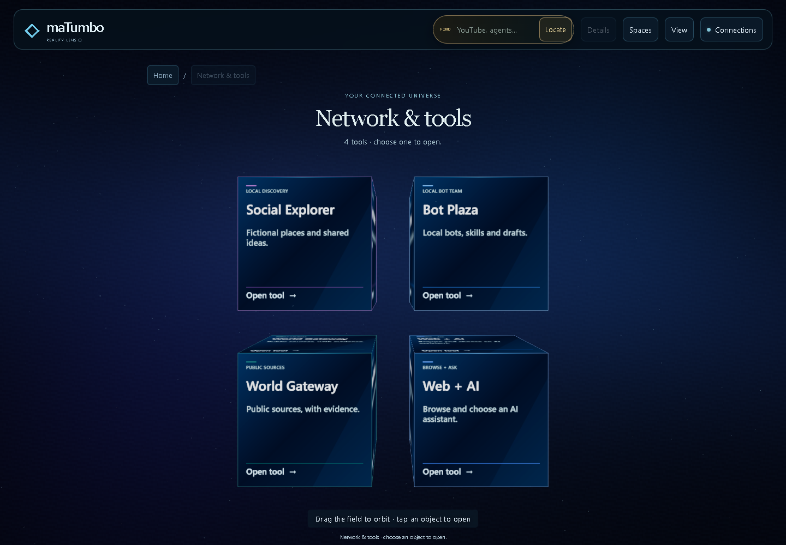
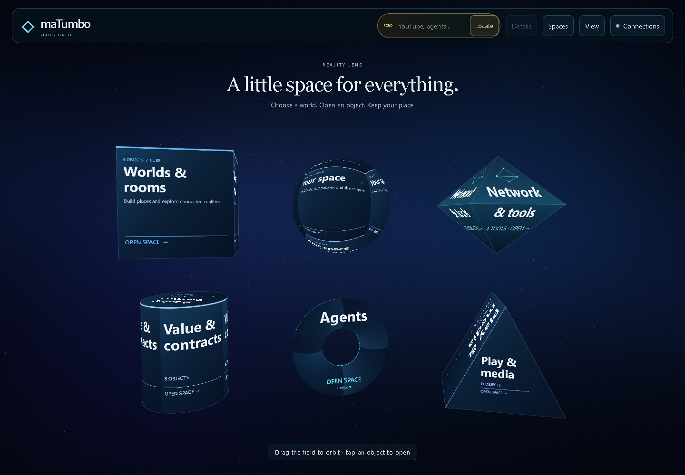
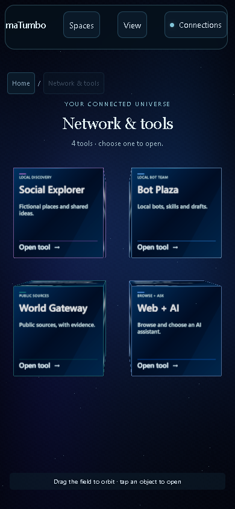

# Network & tools: clearer surfaces and navigation

Network's Home diamond now maps ink through each facet's own horizontal axis. The old world-X projection collapsed left/right lettering into stretched columns. The repaired eight-face mapping includes a restrained connected-node motif, brighter material shading, larger labels and text that clears the equator.

Inside Network, Social Explorer, Bot Plaza, World Gateway and Web + AI form a balanced 2x2 arrangement on desktop and phone. Concise titles, purpose descriptions and Open tool actions belong to their existing body materials. Original controllers, canonical names, saved shapes/positions and explicit creator layouts retain their identity.

The camera reserves the measured heading, breadcrumb/pager and footer heights. It responds to genuine changes in those vertical bounds, while a hover label changing width preserves an intentional orbit. Navigation status has a separate line below the footer hint.

## Verified result

- **53 focused JavaScript tests pass**, with zero failures/skips. Coverage includes real-volume framing beneath multiline headings, Network arrangement and creator overrides, all-form original actions, geometry and existing native-media layout math.
- **36 browser checks pass** across fresh 1440x1000, 390x844 and 640x839 contexts. Actual clicks open all four original tools; eight diamond facets retain horizontal letter detail; headers/footers remain clear; breadcrumbs, browser Back/Forward, reload and Home preserve routes. A real field drag followed by hover retains the orbited camera.
- **Three final CSS checks pass** after the footer spacing adjustment, verifying actual heading/body/hint/status bounds and capturing the final screenshots. JavaScript hashes match the interaction run; all runtime hashes remain unchanged during each run.
- Independent source review caught the hover-width recentering issue; it was corrected and verified physically. Final screenshot review also prompted the footer spacing repair.

[Compact verification record](network-tools-acceptance.json) · [Engine and controls](../REALITY_SURFACES_360.md)

This record covers Chromium software WebGL and phone-sized viewports, not a physical device or XR run. The earlier diamond, native-media and package records keep their original commit identity and scope. Draft PR work only; no merge or public deployment occurred.
