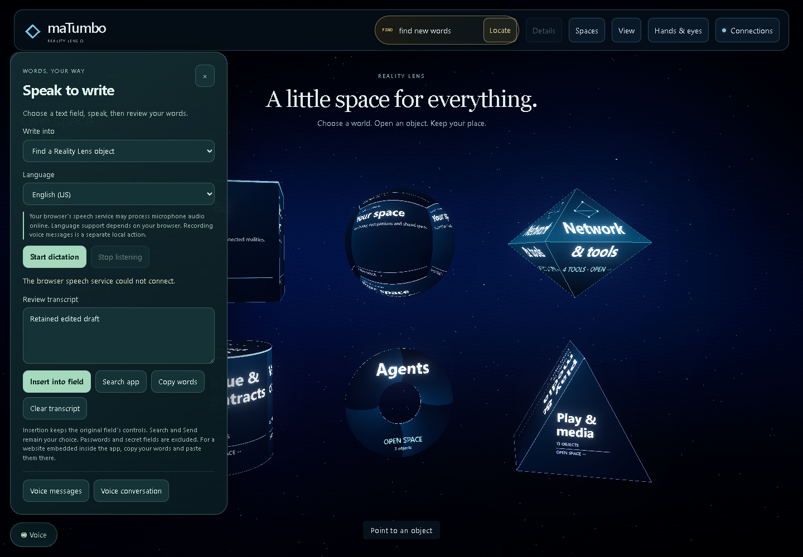
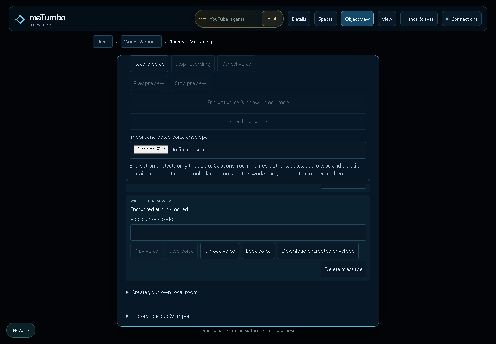
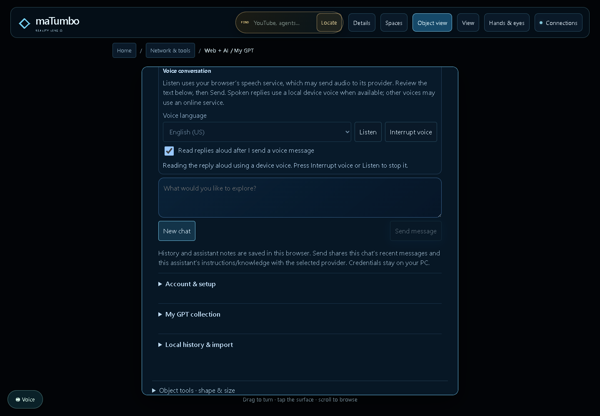
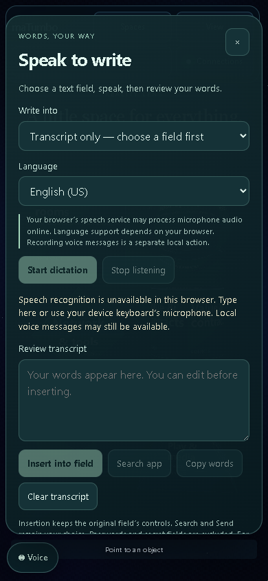
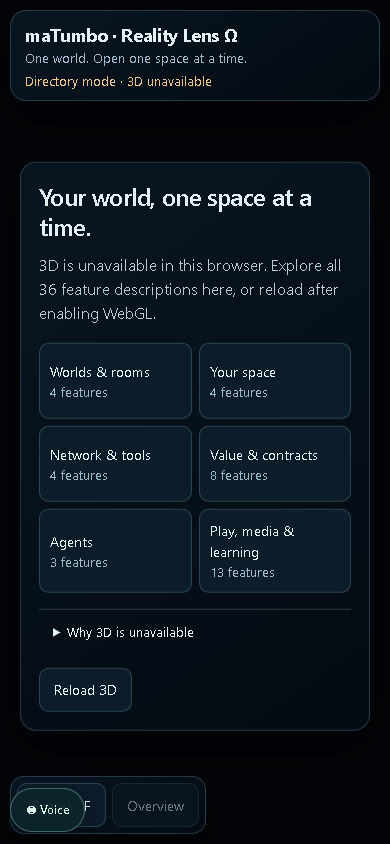

# Voice implementation and acceptance

The Reality Lens demo now offers reviewed voice writing throughout its existing spaces, local voice attachments, separately keyed audio encryption, and opt-in spoken replies in the existing My GPT conversation. The same browser modules are packaged for other applications. This record describes the demo checkout; adoption in another repository has separate evidence.

## Use it

1. Open the local app and select a search box, text field, or editable object surface. Press **Voice** or **Alt + Shift + V**.
2. Choose the destination and spoken language. Press **Start dictation**, speak, and press **Stop listening**. Edit the reviewed words, then press **Insert into field**. **Search app** is a separate explicit action. Dictation does not press Send or execute recognized commands.
3. For voice messages, enter your own local **Rooms** conversation and press **Record voice**. Stop and review playback before saving. Choose encrypted audio, prepare the encrypted attachment, and keep its unlock code separately before saving. Unlock and playback remain explicit actions.
4. For a voice conversation, open **Web + AI → My GPT**, choose an existing provider/account, and press **Listen**. Review and **Send** through the original chat owner. Enable spoken voice replies if desired; **Interrupt voice** stops playback. A working account or API configuration is still required for a real AI reply.

Passwords, API keys, unlock codes and other secret fields are excluded from dictation. Numeric/date fields retain their constraints and require exact numeric or ISO values; ambiguous spoken words remain available for review. Existing native editing, form submission and rich-text formatting remain in place.

## Verified behavior

| Verification | Result and scope |
| --- | --- |
| Complete JavaScript suite | **2,637 passed**, 113 suites, zero failures/cancellations/skips. Includes the unchanged crypto-renderer ownership test. |
| Complete Python suite | **76 passed**. Includes launcher, protected loopback/provider and reproducible package/extraction checks. |
| Mounted desktop voice flows | **11 passed**: original selection insertion, cancelled/failed take preservation, literal rich text, native numeric/calendar constraints, real recording/playback, encryption/unlock/lock, hidden-owner cleanup, original GPT Send, interrupted speech and persisted-page lifecycle. |
| All feature mounts | **72 checks passed** over all 36 features in desktop and phone viewports. Exactly one voice owner/button/panel; opening a feature or Voice does not start capture. |
| Mobile layouts | **390×844, 320×740 and 844×390 passed**. Unsupported recognition, denied recording permission, reviewed app search and local room controls remain usable without horizontal overflow. |
| Extracted kit | **51 dependency-free Node checks passed**. A separately served extracted example also passed original-field insertion without submission, stale-document rejection with retained words, browser encryption round trip, and actual same-origin iframe activity coordination. |
| Failed graphics startup | Forced WebGL failure still exposes one usable dictation/copy panel. Rooms and GPT honestly report that their app owners have not loaded. |

Recognition and speech playback use controlled browser doubles. Actual MediaRecorder receives a generated oscillator stream. GPT uses a clearly labeled test response on the existing backend path. **No physical microphone or camera was accessed**, no account authorization was started, and no real provider inference was verified. Phone tests are desktop browser viewport emulations.

The desktop voice run observed existing public Kalshi fetch failures; these are retained in its report. They did not stop voice flows. This record does not establish that every external network service is available.

The [source fingerprints](voice/source-fingerprints.json) identify the actual tested working-copy bytes, including new files. [Test summary](voice/test-summary.json), [desktop flows](voice/voice-browser-check.json), [route matrix](voice/voice-routes-check.json), [mobile layouts](voice/voice-layout-check.json), [extracted example](voice/voice-kit-browser-check.json) and [graphics fallback](voice/voice-fallback-browser-check.json) preserve the evidence and its limits. CI is recorded against an exact pushed commit separately; these local results alone do not establish a green remote workflow.

## Processing and storage

Browser speech recognition may process audio through an online vendor service; recognition and languages vary by browser. Audio recording stays local. Spoken replies prefer matching local voices when the browser identifies them as local; other voices may use online services. See the [voice guide](../VOICE.md) for source links and device fallbacks.

Recordings are bounded to 60 seconds/384,000 bytes. AES-GCM-256 encrypts the audio with a random 256-bit key and 96-bit IV; authenticated metadata detects envelope tampering. The separately retained unlock code is not saved/exported with the encrypted attachment. Captions, timestamps and room metadata remain readable. Unlocked audio exists in memory for explicit playback and is removed on lock/owner exit. Loss of the unlock code prevents recovery.

Local Rooms do not deliver messages to another device. This implements audio-envelope encryption, not a remote end-to-end messaging protocol or recipient identity system. The existing account, provider, financial and simulation owners retain their boundaries.

## Portable artifact

The builder produces `matumbo-browser-voice-0.1.0.zip`, a payload manifest and SHA-256 file under a chosen `--output` directory. The package is private, MIT licensed, and contains no provider bridge, credentials, project history or remote-delivery service. Its source revision identifies the base commit; per-file hashes identify the exact packaged content. [Packaged hashes](voice/kit-manifest.json), [archive checksum](voice/kit-SHA256.txt).

```sh
python scripts/build_voice_kit.py --output work/voice-kit-new
```

The current verified ZIP contains 15 payload files plus its manifest, is 46,626 bytes, and has SHA-256 `0baa37af8a80934ed9e9c80b6ec8530ba9ed467562ed572c4ae2e7198abdf61e`. The portable example needs only a static localhost/HTTPS server. Adoption still supplies the actual app's context, navigation, storage and AI owners.

## Screenshots










