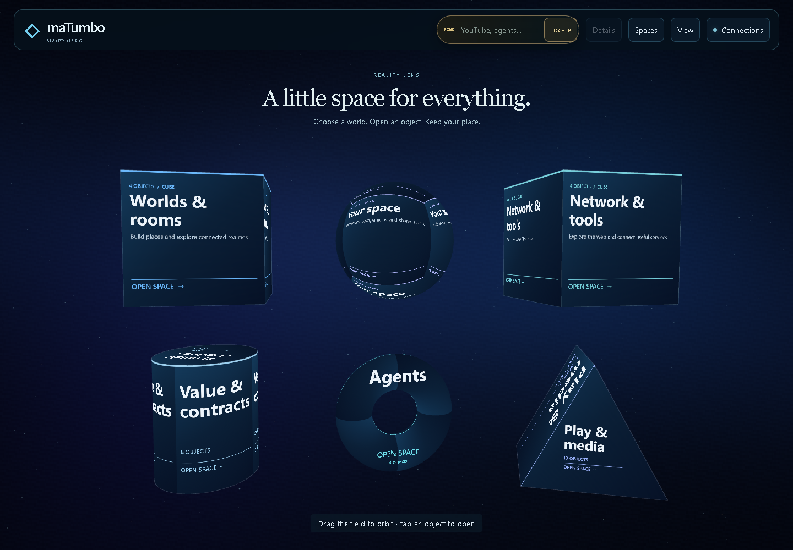
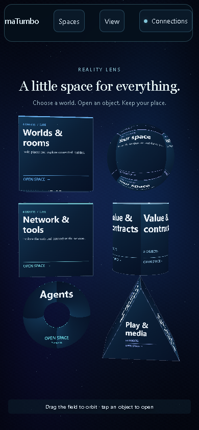
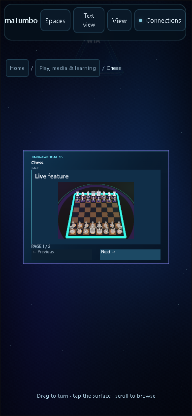

# Whole-body Reality Lens acceptance

Five volumetric families now organize six useful home spaces. Bodies open their spaces, feature controls retain their original state owner, and live information covers the actual geometry's UV charts. This supersedes the earlier front-only projection.

## Verified local result

- **2,289 / 2,289 JavaScript tests**, across 104 suites, and **20 / 20 Python tests**. Zero failures, skips or cancelled tests. Runtime, test and script hashes stayed unchanged during the final suite.
- **20 / 20 physical mouse/keyboard checks** at 1440 × 1000 desktop and 390 × 844 phone viewports. All five families executed an original control once. Typing, Escape, the same input/value across shape changes, body turning without accidental activation, a real checkbox and original chess canvas input passed. The first chess move was **e2 → e4** on both viewports.
- **12 / 12 navigation checks** across both viewports: full home geometry fits, the torus hole rejects clicks, bodies enter their actual space/feature, canonical breadcrumbs and URLs agree, Back/Forward and cold reload preserve the space, and Home returns cleanly. No page errors.
- **36 / 36 canonical routes mounted on each viewport** through the read-only navigation handoff. Person keeps its dedicated owner. This establishes mounting and ownership, not every workflow or external service.
- **4 / 4 YouTube search/player-continuity checks**. Physical search returned eight live results without a fixture. A surface result used one original iframe, which survived rotation and all five shape changes. Results remained accessible; phone resizing kept the same player without horizontal overflow.

[Machine-readable summary](whole-body-acceptance.json) · [Engine and controls](../REALITY_SURFACES_360.md) · [Launch guide](../DEMO_LAUNCH.md)

## Repairs exposed by verification

Canvas content receives a dedicated readable chart, keeps its aspect ratio and uses hit regions matching the fitted pixels. Chart focus keeps the reading direction upright. Chess has a readable capture aspect, raised camera and transparent-glyph hit rejection. Native inputs preserve nodes and form ownership, reconcile their browser position and finish editing on Escape without closing the feature. Gesture disposal cancels the original pointer once and releases capture.

Cold space reload formerly started an older universal renderer over the canonical owner. That experiment now requires explicit selection. The City history handler no longer resets a restored space to Home, and the obsolete return button no longer covers the Home breadcrumb. The final suite also updated a canvas test double for the pixel APIs used by torus typography; the preceding failed run remains in local evidence.

## Limits and release identity

These are Chromium software-WebGL checks, including a phone-sized viewport. Physical phones, hardware GPU performance, multitouch, AR and XR were not verified. Two-pointer gesture-pad controls remain available through **Text view**.

The actual YouTube player stayed at currentTime 0 / readyState 0 during the run. Search and player continuity passed; streaming playback is **unverified**. The cross-origin iframe remains one planar browser player because its pixels cannot become a curved CanvasTexture.

NVIDIA remains **key needed** until an owner supplies a valid server-side credential. Bounded public connection checks retain their existing authority rules; this does not claim universal coverage of free APIs or authenticated inference. TUMBO-SIM and the economic engine remain local simulations.

This report records local acceptance. Exact-commit CI and extracted-package evidence accompany the release. The PR remains draft; no merge or public Pages deployment was performed. Older economy acceptance in the historical review keeps its original commit identity and is not relabeled as new mesh-interaction coverage.
