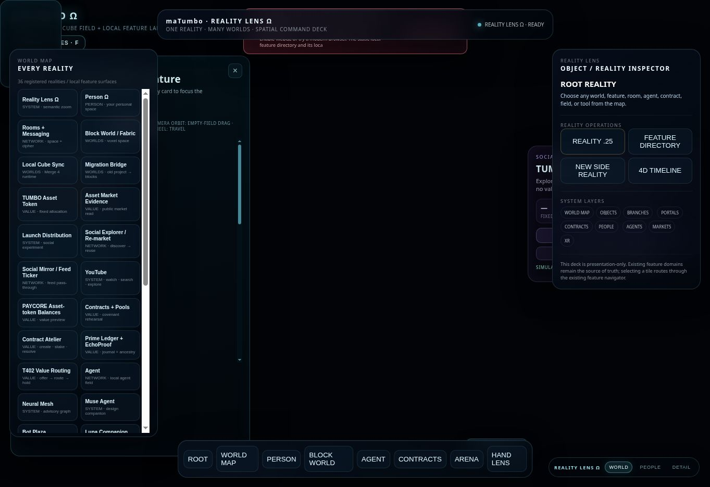
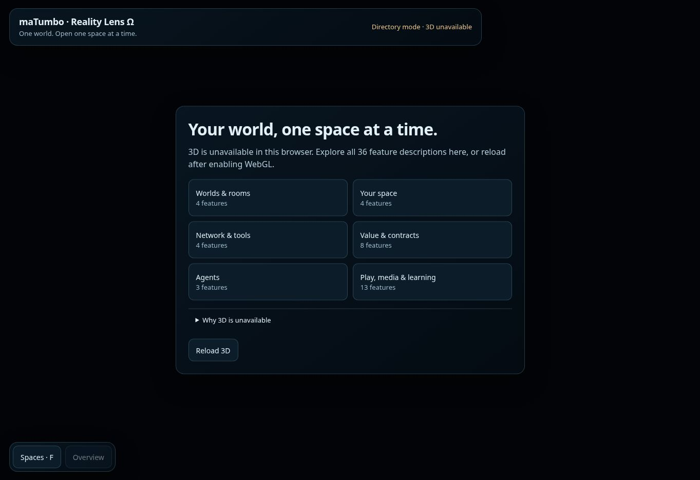
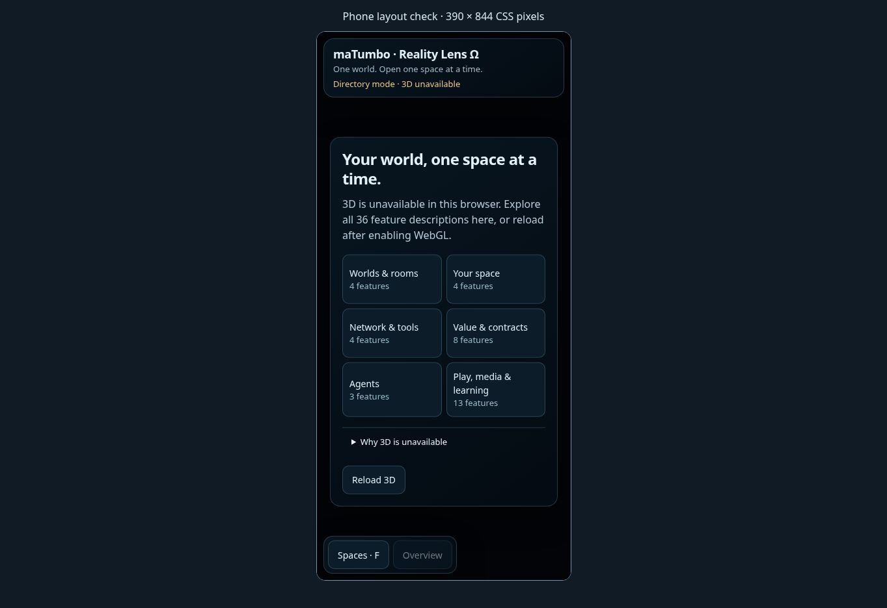
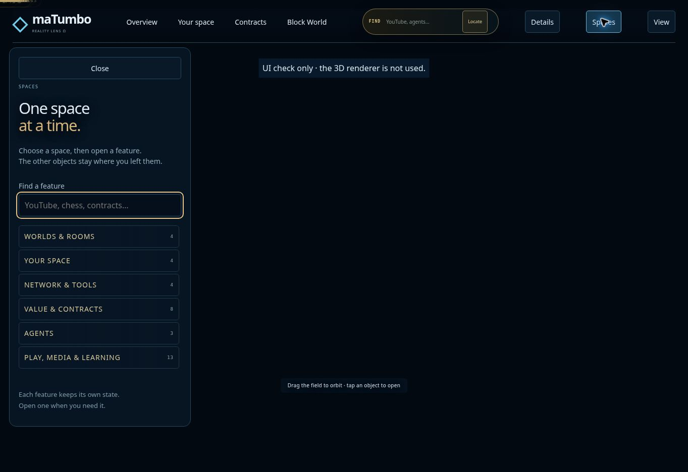
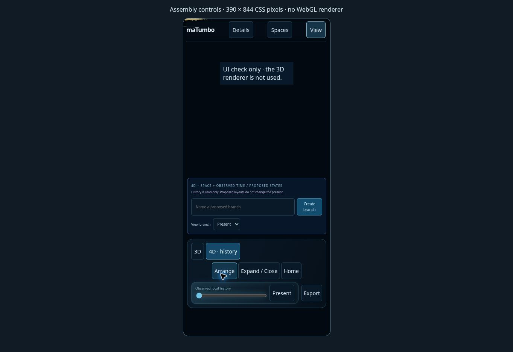
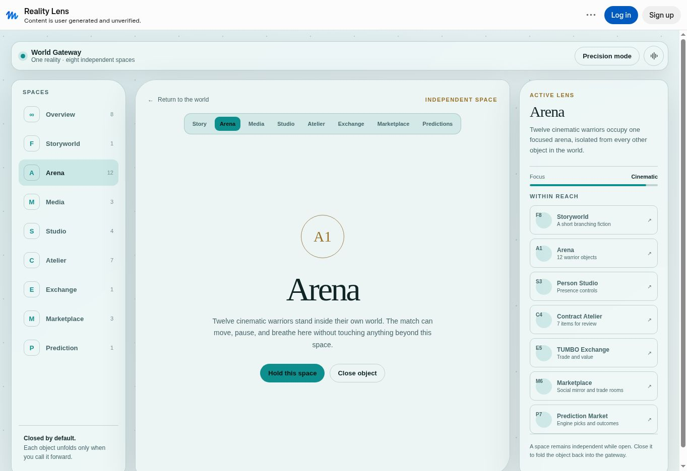

# Reality Lens cleanup and review

Reviewed on 3 October 2026 against commit `9760fa7493e8a0e1f7864f08c86c2ae0a1181815`.

The main problem was competing navigation: the legacy Mission Control, newer command deck, inspector, launch panel, and bottom controls appeared together. The cleanup gives the world one navigation system, six searchable spaces, and controls that open when requested.

Sources: [original maTumbo demo](https://carltheghost.github.io/matumbo-living-reality-demo/) and [Muse Reality Lens reference](https://muse.ai/s/reality-lens-pxj61xkxvpxhgrd). Both were inspected through their public browser interfaces. The Muse Arena view inspired the focused-space interaction and explicit return path. Its observed view was descriptive; this review does not establish that its warriors or games are implemented.

## Findings and implemented fixes

| Priority | Problem observed | Result in this change |
| --- | --- | --- |
| High | Two feature menus compete and overlap other panels. | One active directory; legacy controls stay hidden and keyboard-inert while the calm chrome is mounted. The Assembly uses its own Spaces control. |
| High | The command deck says READY after the renderer fails. | Runtime status distinguishes loading, ready, and unavailable. Failure shows a usable description directory and an expandable diagnosis. |
| High | A feature can appear active even when no canonical navigator is available. | Activation dispatches to the existing navigator only when ready. Directory mode explicitly says that the selected feature is not running. |
| High | The selected-object Open feature handler receives a click event as its feature ID. | The handler calls `enter()` without the event, preserving the selected ID. Browser checks confirmed `youtube` reaches the navigation callback. |
| High | GitHub Pages omits the root mobile JavaScript and runtime assets. | A shared static build includes root JS, HTML, CSS, vendor, source, and assets. Its output is tested; development files are excluded. |
| Medium | All 36 tiles and advanced operations are exposed at once. | Six collapsed spaces; search reveals matching features; only one group expands during ordinary browsing. |
| Medium | Quick search steals focus after typing. | Quick search retains focus and Enter navigates to its result. Empty searches show useful feedback. |
| Medium | Phone View controls belong to a command deck hidden during Assembly mode. | An Assembly View button opens the actual 3D, arrangement, and history controls. |
| Medium | History branches overlap the phone view toolbar. | Branch placement follows the measured toolbar height, with a verified 12-pixel gap at 390 × 844. |
| Medium | Spaces, object details, and advanced controls can compete. | Opening one closes the others. Escape dismisses the open controls, including from search. |
| Medium | Main labels use cryptic Latin and small touch targets. | Main navigation and object instructions use English; primary buttons are at least 44 pixels tall. |
| Medium | New Branch / 4D command-deck buttons only change descriptive text. | These misleading duplicate operations are removed. Actual Assembly side realities and observed history remain available through their existing owners. |

## Evidence

The browser used for this review cannot create a WebGL context. The before and after root screenshots therefore compare the same renderer-unavailable condition. This is a browser limitation, not evidence that the public demo is unavailable for everyone.

### Original root



### Updated root, directory mode



### Updated phone layout

The actual index page runs inside a 390 × 844 iframe. Its document width and scroll width both measured 390 pixels; no horizontal page overflow was observed. This checks responsive CSS, not a physical phone or touch hardware.



### Assembly controls

These fixtures instantiate the actual Assembly controller and Three.js scene data with a test canvas. They do not render 3D and are excluded from the Pages artifact. The empty scene area is intentional and must not be interpreted as the production world appearance.





### Muse reference



## Verification

| Check | Result |
| --- | --- |
| Focused navigation, responsive layout, bridge, directory, and actual Pages build tests | 55 passed, 0 failed |
| Full suite before changes | 1,767 tests; 1,716 passed; 51 failed |
| Full suite after changes | 1,771 tests; 1,720 passed; 51 failed |
| Comparison of failing test names | Same 51 failures; no new failures |
| JavaScript syntax, shell syntax, and `git diff --check` | Passed |
| Browser interactions | Search match and no-results states, selected-feature callback, retained quick-search focus, Escape, closed initial controls, mobile View/history, mutually exclusive panels |

Focused command:

```sh
node --test tests/reality-lens-chrome.test.mjs tests/mobile-layout.test.mjs tests/mobile-panel-manager.test.mjs tests/feature-navigator.test.mjs tests/reality-lens-engine.test.mjs tests/universal-reality-bridge.test.mjs
```

The [unchanged failure inventory](unchanged-test-failures.txt) records the pre-existing failing tests. The full suite is not green. GPU rendering, visual geometry, touch gestures on hardware, and each feature's provider-specific end-to-end behavior remain unverified in this environment. This is a navigation and presentation repair, not certification of every underlying feature.

No ledger, wallet, identity, signing, settlement, or external execution authority is added. Existing scene geometry and the right-side TabEngine dock are not changed by this patch.

The repository's `AGENTS.md` was followed for the isolated branch and evidence. Its referenced continuity files and task packet are absent from the baseline checkout. It states: “Submit a diff and evidence; never merge your own branch.” This change is delivered for review; deployment occurs through the existing Pages workflow after merge.

## Complete canonical feature inventory

All 36 canonical feature IDs appear exactly once in the shared directory. Names and grouping remain backed by the existing registry and Reality Lens group resolver. The legacy static HTML counts 37 links because it also includes a separate Launch Kit utility; available utility launchers remain accessible as tools.

| Space | Feature | Canonical ID |
| --- | --- | --- |
| Worlds & rooms | Rooms + Messaging | rooms |
| Worlds & rooms | Block World / Fabric | block-world |
| Worlds & rooms | Local Cube Sync | runtime-sync |
| Worlds & rooms | Migration Bridge | migration |
| Your space | Person Ω | person |
| Your space | Social Mirror / Feed Ticker | social-mirror |
| Your space | Luna Companion | luna-companion |
| Your space | Wardrobe Atelier | wardrobe-atelier |
| Network & tools | Social Explorer / Re-market | social-explorer |
| Network & tools | Bot Plaza | bot-plaza |
| Network & tools | World Gateway / Evidence | gateway |
| Network & tools | Web + AI | web-ai |
| Value & contracts | TUMBO Asset Token | asset-token |
| Value & contracts | Asset Market Evidence | asset-market |
| Value & contracts | Launch Distribution | launch-distribution |
| Value & contracts | PAYCORE Asset-token Balances | paycore |
| Value & contracts | Contracts + Pools | contracts |
| Value & contracts | Contract Atelier | contract-atelier |
| Value & contracts | Prime Ledger + EchoProof | ledger |
| Value & contracts | T402 Value Routing | t402 |
| Agents | Agent | agent |
| Agents | Neural Mesh | neural-mesh |
| Agents | Muse Agent | muse-agent |
| Play, media & learning | Reality Lens Ω | reality-lens |
| Play, media & learning | YouTube | youtube |
| Play, media & learning | Picture Matter | picture-matter |
| Play, media & learning | NFT Atelier | nft-atelier |
| Play, media & learning | White Paper | white-paper |
| Play, media & learning | Gesture Lens | gesture-lens |
| Play, media & learning | World Events / Evidence | world-events |
| Play, media & learning | Tennis Evidence / ATP · WTA | sports-events |
| Play, media & learning | Multi-Sport Scoreboards | multi-sport-events |
| Play, media & learning | ARENA / Game Lab | arena |
| Play, media & learning | Chess | chess |
| Play, media & learning | Financial Academy | academy |
| Play, media & learning | Phone / PC / XR | projections |
