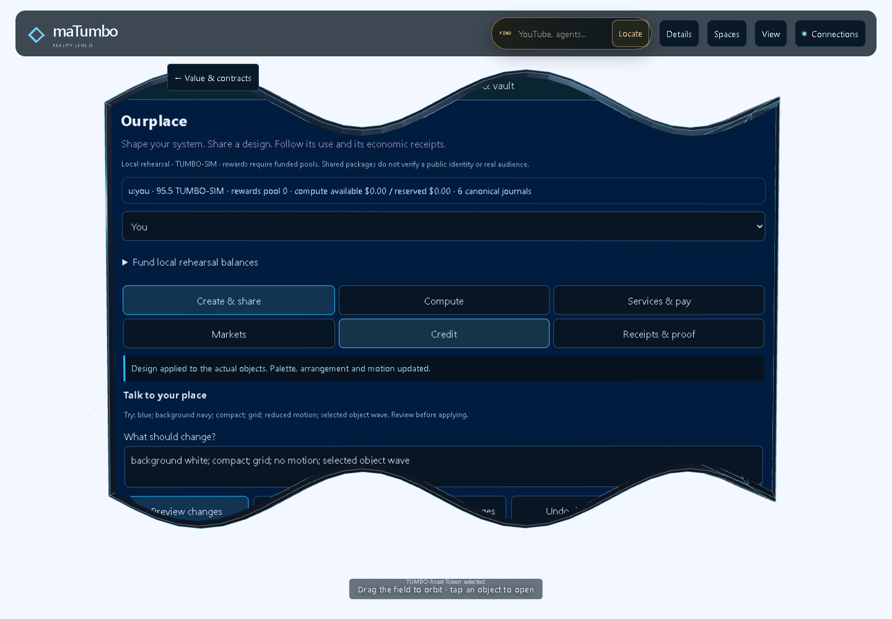
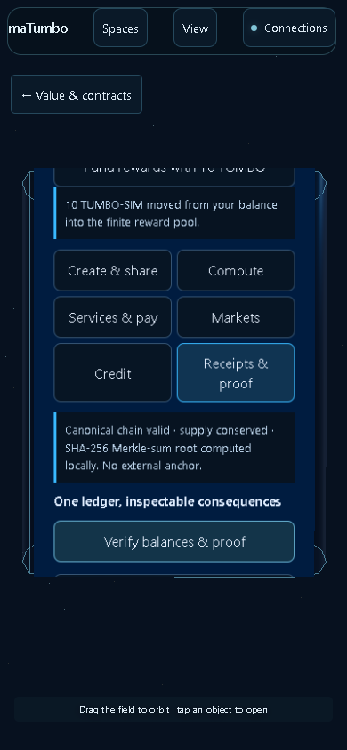
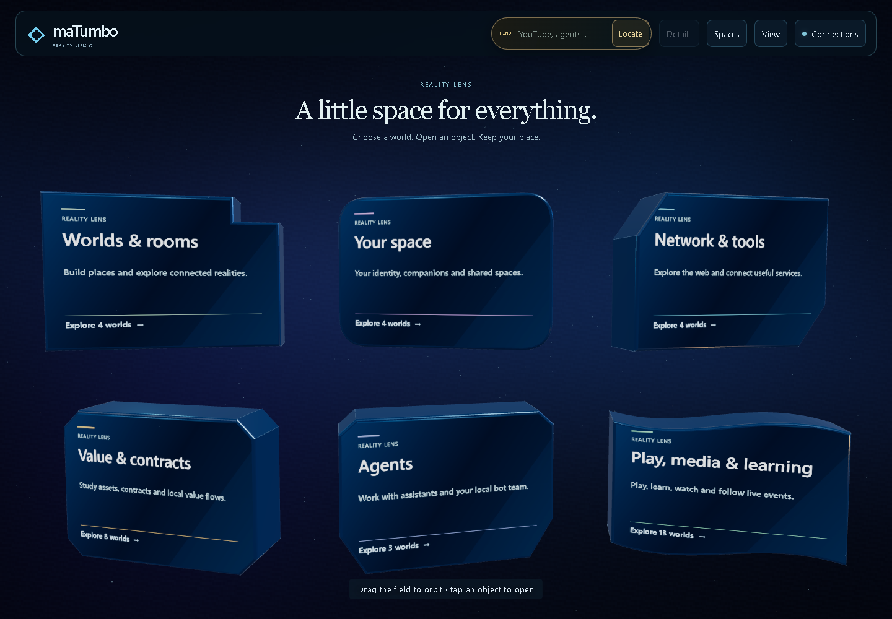
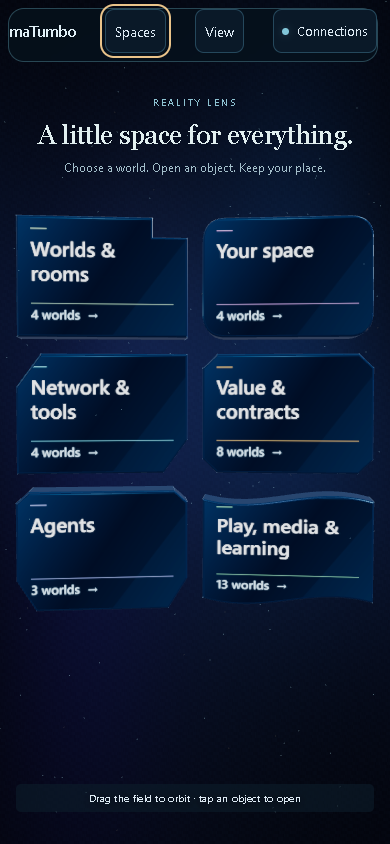
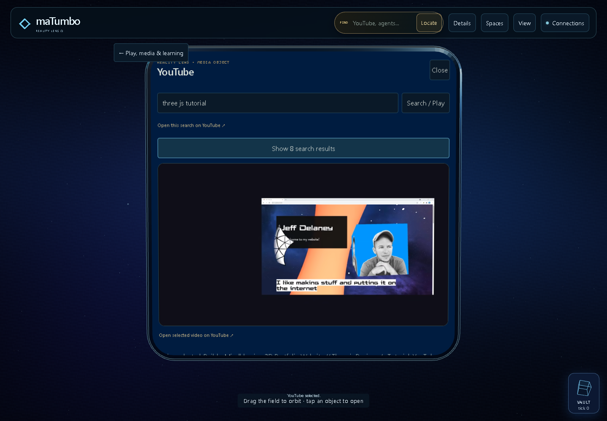
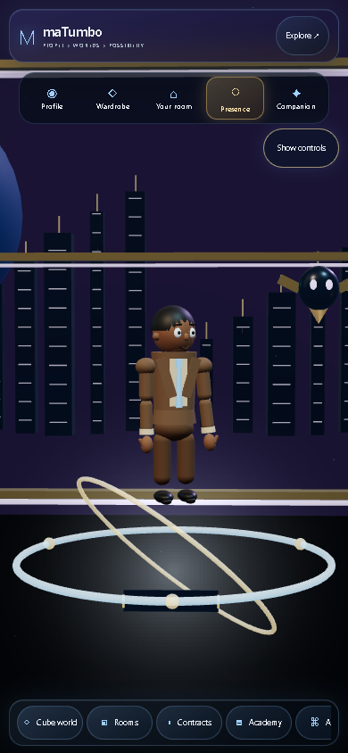

# Reality Lens: complete cleanup and functional repair

## Ourplace creator and economic expansion — verified 2026-10-03T18:01:13.702308+00:00

Ourplace implements the requested describe → preview → apply → share → use/remix → attribute → funded reward loop in the existing Asset Token object. All six design categories are supported: layout, object, tool, agent, workflow and experience. Voice is a user-triggered browser capability; typed bounded instructions work without it. This is a functioning local rehearsal with separately identified unavailable production adapters.

- Actual design application changes object shapes, palette, arrangement, density, navigation preference and motion. Manual changes to unrelated object forms survive applying and undoing a design. Preview staleness rejects geometry changes before application.
- Local publication records immutable versions and licenses. JSON share downloads carry descriptors and reviewed licensed ancestry. Imported origin survives edits, undo and reload; unverified imported authors cannot become local payout authority. A legacy changed design without provenance remains usable but requires an explicit fresh session before publishing.
- Applying a registered design as another test participant records a local observation. Self-use, ancestor self-use and repeated actor/design/day/session evidence cannot farm another reward. A funded payout allocates exact integer shares among distinct ancestry creators; duplicate settlement does not debit again. This does not prove a public audience or identity.
- One existing canonical TUMBO engine owns all value. Compute reservations, actual deterministic local-tool results, simulated usage reconciliation, unused-credit release and guarded funded claims share that owner. Contribution consent records bounded metadata, provider scope, retention, acceptance and revocation.
- Services reserve and split payment atomically, with approved compensating refunds. Manually matched reserved spot orders support partial fills and cancellation. Collateral loans use lender-owned funds, fresh two-source local valuation, repayment/default/liquidation and visible residual debt. Prediction contracts support evidence proposals, challenges, two explicit approval roles and exact parimutuel settlement/INVALID refunds.
- SHA-256 command ancestry and amount-bearing Merkle-sum proofs commit balances and obligations; the existing canonical receipt integrity chain remains separately labeled. There is no external proof anchor, custody, signing or production settlement authority.
- Paired restore validates canonical journal ownership and compute/consent/refund protection before adopting history. Rehearsal time must match its recorded commands. New canonical writes and failed adoption observations cannot exceed the supported export history. A full timeline leaves compute debit and usage paired, and displays a projection notice.

Actual current-source browser acceptance passed on desktop and phone: both core creator/compute/proof flows, both extended creator/remix/share/import/reload flows, both financial suites, and both native design-effect/shortcut checks. The financial suites contain 101 desktop and 101 phone hit-tested interactions, with 5 and 5 persisted reload comparisons. A disposable context filled the shared timeline to its 4,000-event limit, then clicked WebAI usage recording and verified the matching debit, usage receipt, valid unchanged timeline and visible projection notice. Microphone speech, hardware GPUs, physical phones and XR were not simulated into acceptance.

[Complete Ourplace usage and architecture guide](OURPLACE_ECONOMY.md) · [Acceptance totals](economic-acceptance.json) · [Creator interactions](ourplace-creator-browser-verification.json) · [Financial desktop](desktop-ourplace-finance.json) · [Financial phone](phone-ourplace-finance.json) · [Paired replay](economic-runtime-paired-verification.json) · [Capacity probes](economic-runtime-capacity-probe.json)





October 3, 2026. Work continues in draft [PR #70](https://github.com/carltheghost/matumbo-living-reality-demo/pull/70), branch `fix/reality-lens-calm-2026-10-03`, in the existing public repository. The starting PR was `f9789c9922baf69a8fa912884ae2e55ee123f72a`; main was `9760fa7493e8a0e1f7864f08c86c2ae0a1181815`. This report supersedes the earlier 55-check review and the intermediate pass that still had 46 inherited test failures. Public deployment remains separate from this draft.

The default opens six readable space objects. A space exposes a bounded group of features; selecting a feature attaches its existing controls to the owning physical object front. Search reaches all 36 canonical IDs. The earlier all-objects assembly remains available as an optional view. Phone pages contain at most four objects; desktop pages contain at most six.

The [Muse reference](https://muse.ai/s/reality-lens-pxj61xkxvpxhgrd) was inspected in a rendered browser and informed the focused space and return path. The [public maTumbo page](https://carltheghost.github.io/matumbo-living-reality-demo/) returned HTTP 200, but its remote WebGL visit timed out during the initial comparison. Comparisons and acceptance here use actual local Three.js rendering of the starting and repaired branches. They do not establish a new public deployment.

## Visible result and object ownership









The entry bodies are procedural beveled Three.js geometry: stepped portal, capsule, clipped prism, vault, shield and flowing slab. They are not imported sculpted assets. The object engine supplies one entity ID, body-local contour, physical information face and interactive front. The seven editable forms are phone, square, rectangle, sphere, cylinder, cube and wave. Geometry caps, CSS clipping and projected hit regions consume the same contour. Shape, size, state, provenance and related-feature tools sit inside that front.

## What was repaired

| Area | Concrete resulting behavior |
| --- | --- |
| Landing and navigation | Six spaces replace the initial 36-feature field. Search, phone paging, space return and browser history retain canonical feature ownership. Person Studio takes and returns camera ownership cleanly. Optional controls start closed. |
| Surface geometry | Shared contours fix the sphere/cylinder front boundaries and reject clicks outside a body. Object tools remain part of the same front. Stable inspector references prevent hover transitions from throwing after those controls move into CSS3D. |
| Clickable layout | Wave fronts reserve space inside their curved edges so close buttons and lower controls are reachable. Web + AI uses one scroll flow and separates overlapping header buttons. Native fronts remain transparent and unframed. |
| Auxiliary panels | Pointer and keyboard resizing, eight handles, arrangement, depth/front order and versioned persistence work for auxiliary surfaces. The manager excludes native feature surfaces and detached Object tools; it discovers later auxiliary panels. |
| Asset Token | Balances, receipts, transfers, vault and activity load from explicit controls inside the existing Asset Token object. Their sections start collapsed. No transfer/vault/activity chips or miniature renderer loops appear on startup. |
| Transfers | One canonical QuoteEngine owns balances, supply, receipts and escrow. Send/receive/tip/burn, hold/settle/cancel and explicit TUMBO demo funding use its journals. Replay last transfer captures the original successful payload and key, so a fresh form key or later amount edit cannot cause a second debit. |
| Vault and lifecycle | Stake/lock/deposit/savings positions use that same engine. Shared vault integrity checks owned coverage. Withdrawal preserves ownership; store reload rebuilds balances from validated journals. Vault WebGL failure has working Close/Escape controls, and Escape closes only the top view while preserving the feature below. |
| Quotes, receipts and BotPay | Issued quote membership, engine ownership, expiry, exact amounts, idempotent payloads, chain integrity, immutable challenges, spend limits and failed-operation rollback are tested. No competing balance or proof chain was reinstated. BotPay registration is unfunded by default. |
| Contract Atelier | Existing modes remain supported. Local algorithmic house/pool accounting, position selling, simulated-role approval and completion paths are repaired. The mounted workflow creates a contract, gathers both local approvals, attaches evidence and completes with one simulated receipt. |
| Person and input | The physical Agent Smith avatar is preserved. Profile portraits remain profile UI. All five phone tabs and the Show/Hide controls work. Hand joints use real world coordinates and camera depth; asynchronous photo textures and disposal do not leave stale objects. Synthetic hand packets are explicitly test input. |
| Media and bots | In-object YouTube search uses bounded public-provider failover, cancellation and stale-response cleanup. Selecting a real result leaves one player. Bot proposal expiry/replay paths do not duplicate rows. |
| Module ownership | First-party caches use one current version. Token adapters recognize the complete canonical API across module URLs. Portal tests use the same versioned issuer/session graph as the browser; foreign issuers, copied handles and foreign sessions still fail closed. Private WeakMap/Symbol capabilities were preserved. |
| Launch and delivery | A Windows launcher verifies the exact loopback service, repository fingerprint, listener ancestry, process creation time and instance before reuse or stop. Static packaging is deterministic, excludes server/key files and includes per-file hashes. Cross-platform CI runs the complete JS and Python suites. |

## Verified tests and actual interactions

The first Windows CI run exposed two source-character-distance checks that counted CRLF differently from LF. Their source reads now normalize platform line endings while preserving every assertion. All four integration checks also pass against eight real CRLF fixture files. This is test portability, not an additional product-behavior repair.

A subsequent Windows run passed 2,196 tests and stopped in the actual launcher fixture while trying to rebind an exclusive listener to the recently stopped bridge's port. The fixture now waits for the captured owned process to exit, checks its original port has no listener, and reserves an independent exclusive foreign listener on an OS-assigned port. The original identity, reuse and refusal assertions remain; foreign ownership must also stay unchanged. All five focused checks and two additional full lifecycle runs passed, with captured processes and records absent afterward. The product launcher and stopper are unchanged. [Focused results](demo-launch-focused-tests.tap) and [repeat lifecycle evidence](demo-launch-lifecycle-repeat.json).

The final complete JavaScript run on this Windows checkout passed **2,197 tests, zero failures, zero skips**. The complete Python run passed **20 tests**. The earlier cleanup phase passed 2,052 JavaScript tests before the economic expansion. Windows launch tests use actual ephemeral listeners to prove launch, reuse, ownership-safe stop, tampered-record refusal and foreign-listener refusal. Python tests cover the real loopback HTTP service with a fake upstream requester and deterministic archive/extraction integrity.

The exact starting PR had 1,771 tests, 1,717 passes and 54 failures on this host. The current clean suite includes functional repairs, expanded regression coverage, malformed-test corrections and migrations from retired APIs/source assumptions to the accepted architecture. A repaired source-pattern assertion or migrated old API test is not an independent product bug. The canonical supply/rates and private portal authority were preserved; tests were not skipped to obtain the passing result.

Browser evidence uses the real pinned Three.js renderer in Chromium with software WebGL/SwiftShader at 1440 × 1000 and 390 × 844. It is not a hardware GPU benchmark or a phone-device/WebXR acceptance test. All 36 canonical routes were opened at both sizes, with zero page exceptions, no visible legacy-panel leaks and no document overflow. Search and return controls were exercised throughout. Stable control-center hit testing additionally found and drove the wave/Web AI layout repairs.

Actual workflows include adding and inspecting a Block World draft cube; completing an Academy lesson with 30 local XP; entering/leaving Rooms; Neural Mesh replay; the complete local Contract Atelier approval/evidence/completion flow; and pointer-clicked chess `e2 → e4`, producing SAN `e4` and Black's turn. Chess coordinates were observed through Three's renderer/camera tooling; board state was not injected.

Asset Token browser checks on desktop and phone exercise demo funding, send, replay after editing the amount, held-delivery settle/cancel, stake/unstake, vault Close/Escape, local activity check-in/drip, common engine identity, receipt-chain integrity and the absence of floating chips. The vault failure path deliberately denies WebGL only to the next optional renderer after the main world has rendered; that controlled failure is separate from the natural software-WebGL run. Auxiliary resizing/arrangement/persistence is exercised through a clearly labeled temporary fixture using the real panel manager.

The media check performed a natural public search for `threejs tutorial`, returned eight real results, selected `Q7AOvWpIVHU` and observed the player's video time advance from 18.770635 to 20.777485 seconds. Both desktop and phone retained one iframe on the owning front. Provider availability can change.

Evidence files: [full route/control audit](usability-audit.json), [token workflows](token-tools-verification.json), [panel controls](panel-controls-verification.json), [media workflows](media-workflow-verification.json), [avatar/input proof](avatar-input-browser-verification.json), [domain review](domain-repair-review.md). CI and release identity are recorded separately against the final committed source and extracted artifacts; this report does not substitute for those records.

## Public connections and NVIDIA

One explicitly enabled, bounded public batch runs on page load: Open-Meteo's labeled New York weather example, Frankfurter/ECB EUR rates, USGS earthquakes and DeFiLlama Aave TVL. Reopening Connections or selecting an ordinary feature does not repeat the batch. Check connections requests another batch. FX has one fixed ExchangeRate-API alternate after a primary failure, retaining the original error, responding provider, timestamp and attribution.

An earlier natural browser run returned live data for all four groups. A separate controlled check simulated only Frankfurter HTTP 403 and used a live alternate response. Those observations do not guarantee future provider/CORS availability. The existing seven public evidence surfaces remain available through their owners and explicit refresh controls. The reviewed adapter catalog is not universal coverage of every free API.

The local Python bridge is detected. **NVIDIA currently reports Key needed; no authenticated inference was verified.** It keeps a server-environment key outside browser code/storage, binds to loopback, fixes its upstream endpoint and bounds prompt, output, timeout, concurrency and local request rate. Send is the inference trigger. Configuration is distinct from a successful cloud answer. [Setup, limits and primary provider sources](../API_CONNECTIONS.md).

## Reproduce

From the source repository or extracted source archive on Windows:

```powershell
./run_local.bat
```

The launcher verifies and opens `http://127.0.0.1:8082/`. To verify independently or stop only its owned process:

```powershell
powershell -NoProfile -ExecutionPolicy Bypass -File scripts/verify-demo-launch.ps1
./run_local.bat stop
```

Python 3.10+ and Node 22+ are sufficient for the documented checks; runtime/build tools use Python's standard library:

```powershell
py -3 scripts/run_tests.py
py -3 -m unittest discover -s tests -p "test_*.py"
py -3 scripts/package_demo.py --help
```

Build a static distribution into a fresh output directory. It can be hosted as static files and excludes the Python bridge and secrets. The source archive includes the launcher, tests and scripts. Public deployment is still unmerged. AGENTS.md's rule, "Submit a diff and evidence; never merge your own branch," remains in force, and the user also prohibits merging without explicit authorization. The other governed/dirty checkouts were preserved.

## Complete canonical feature inventory

All 36 canonical feature IDs appear exactly once in the shared directory. Names and grouping remain backed by the existing registry and Reality Lens group resolver. The separate Launch Kit utility remains accessible as a tool.

| Space | Feature | Canonical ID |
| --- | --- | --- |
| Worlds & rooms | Rooms + Messaging | rooms |
| Worlds & rooms | Block World / Fabric | block-world |
| Worlds & rooms | Local Cube Sync | runtime-sync |
| Worlds & rooms | Migration Bridge | migration |
| Your space | Person Ω | person |
| Your space | Social Mirror / Feed Ticker | social-mirror |
| Your space | Luna Companion | luna-companion |
| Your space | Wardrobe Atelier | wardrobe-atelier |
| Network & tools | Social Explorer / Re-market | social-explorer |
| Network & tools | Bot Plaza | bot-plaza |
| Network & tools | World Gateway / Evidence | gateway |
| Network & tools | Web + AI | web-ai |
| Value & contracts | TUMBO Asset Token | asset-token |
| Value & contracts | Asset Market Evidence | asset-market |
| Value & contracts | Launch Distribution | launch-distribution |
| Value & contracts | PAYCORE Asset-token Balances | paycore |
| Value & contracts | Contracts + Pools | contracts |
| Value & contracts | Contract Atelier | contract-atelier |
| Value & contracts | Prime Ledger + EchoProof | ledger |
| Value & contracts | T402 Value Routing | t402 |
| Agents | Agent | agent |
| Agents | Neural Mesh | neural-mesh |
| Agents | Muse Agent | muse-agent |
| Play, media & learning | Reality Lens Ω | reality-lens |
| Play, media & learning | YouTube | youtube |
| Play, media & learning | Picture Matter | picture-matter |
| Play, media & learning | NFT Atelier | nft-atelier |
| Play, media & learning | White Paper | white-paper |
| Play, media & learning | Gesture Lens | gesture-lens |
| Play, media & learning | World Events / Evidence | world-events |
| Play, media & learning | Tennis Evidence / ATP · WTA | sports-events |
| Play, media & learning | Multi-Sport Scoreboards | multi-sport-events |
| Play, media & learning | ARENA / Game Lab | arena |
| Play, media & learning | Chess | chess |
| Play, media & learning | Financial Academy | academy |
| Play, media & learning | Phone / PC / XR | projections |
