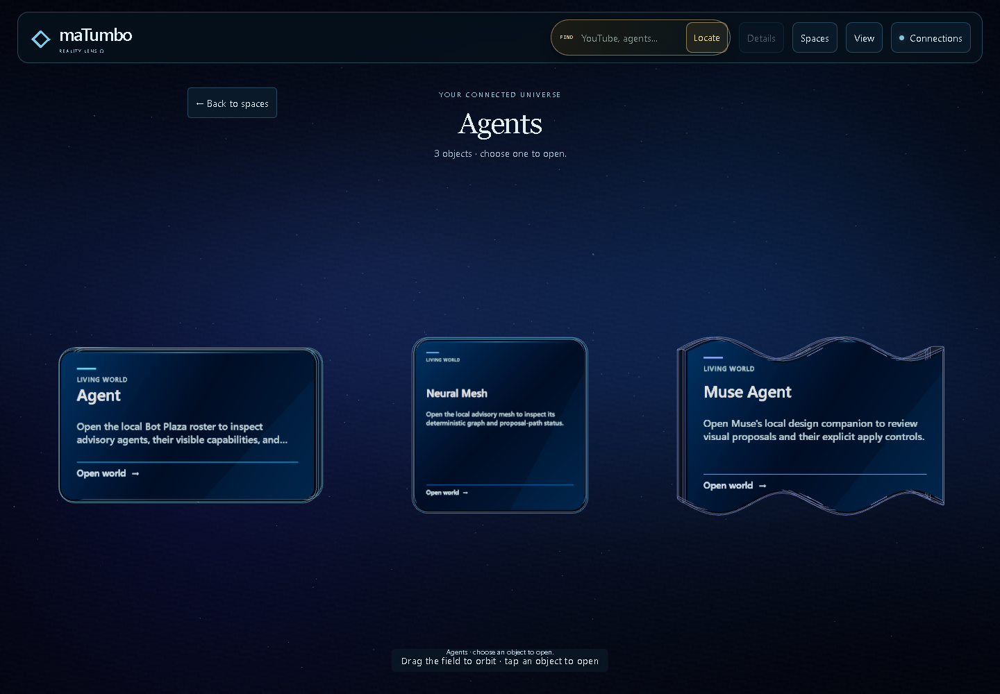
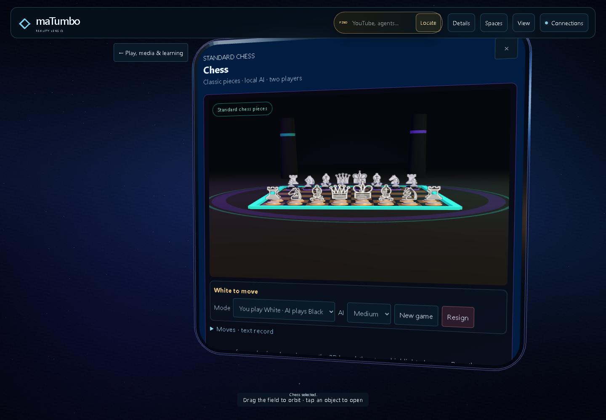
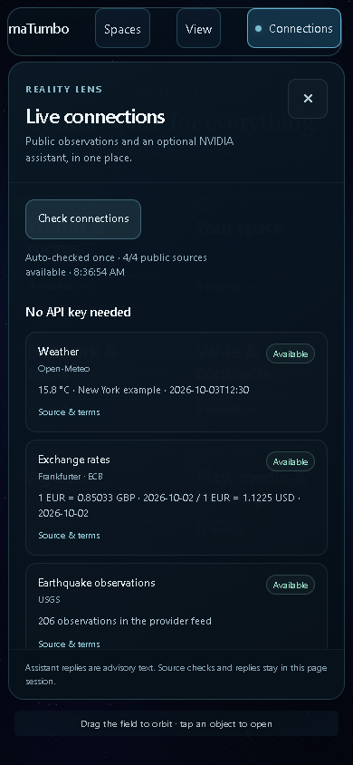

# Reality Lens: calm spaces, native objects and real API connections

Reviewed and implemented on October 3, 2026 in the existing draft [PR #70](https://github.com/carltheghost/matumbo-living-reality-demo/pull/70), branch `fix/reality-lens-calm-2026-10-03`. The starting PR commit was `f9789c9922baf69a8fa912884ae2e55ee123f72a`, based on main `9760fa7493e8a0e1f7864f08c86c2ae0a1181815`. The changes remain a draft and have not been merged or deployed.

The new default is six readable 3D space bodies, followed by a bounded group of feature objects, followed by the selected feature's own attached controls. Search reaches every one of the 36 canonical feature IDs. The same feature owners, saved local layouts, simulation boundaries and TabEngine dock remain in use.

The six entry bodies have actual beveled silhouettes: a stepped portal, capsule, clipped prism, vault, shield and flowing slab. They own their native front materials. This is procedural Three.js geometry, with no claim of imported sculpted assets.

The existing object engine now supplies one entity ID, one body-local contour, one physical information face and one interactive front. Geometry caps, preview aspect ratios, CSS clipping and projected hit regions consume that same contour. All seven body forms keep their identity when reshaped. The sphere's old rectangular cap is corrected to its circular section; the cylinder's front fills its complete physical cut. Invisible hit buttons follow the actual contour and never move into an empty screen pocket. The old detached Details inspector is moved into the owning front as Object tools, with no separate background, border or shadow.

The [Muse reference](https://muse.ai/s/reality-lens-pxj61xkxvpxhgrd) was inspected in a rendered browser. It informed the focused space and return path. The [public maTumbo page](https://carltheghost.github.io/matumbo-living-reality-demo/) returned HTTP 200; its remote WebGL view timed out during the initial browser visit. Visual comparisons below use the exact starting PR served locally, with its real WebGL renderer, rather than claiming a new public deployment.

## Visible result







## Review and repairs

| Problem | Result |
| --- | --- |
| A large field exposes all features, connectors and competing controls together. | The default shows six space bodies; opening one hides the other groups. Larger spaces page through at most six objects on desktop or four on phone. The optional All objects view preserves the earlier full assembly. |
| Labels are small or visually separate from their objects; rear edges ghost through text. | Titles and summaries are rendered onto the geometry's own front/cap material. Correct cap UVs, front-face rendering and opaque reading fronts preserve legibility. Phone fronts use larger titles and counts. |
| Separate contour generators make controls and clickable areas disagree with the body. | One shared physical contour drives all seven native caps, clip paths and projected hit regions. Native artifact tests check the cap geometry and seam; mounted browser tests reshape the same live entity through all seven forms. |
| Details can reopen a second styled inspector over the selected object. | Shape, size, state, provenance and related-feature tools are inside the same reading skin. The independent screen-positioning path is removed. |
| The old world floor cuts lines through the new objects. | The Lens hides the legacy floor and horizon rings, including after feature handoffs restore world presentation. |
| Camera framing wastes phone space and overlaps the page controls. | Framing fits both dimensions, aligns phone objects below the heading, and reserves extra height for the pager. Resizing keeps the focused object on its containing page. |
| A generic panel manager collapses the Spaces drawer or adds unrelated grips. | It excludes the Assembly and Person Studio, and preserves attached live surfaces. Spaces search now remains usable. |
| Person Studio and Reality Lens both own camera animation. | Person handoff closes the Assembly; returning to Lens restores the six-space view. |
| Back/Forward restores only a subset of feature IDs; old draft/person parameters leak into ordinary navigation. | All registered feature routes and the root restore without writing another history entry or refreshing a provider. Ordinary selection clears stale route context. |
| White Paper opens without its native surface mapping. | The selected White Paper surface now attaches through the existing owner. |
| Replay can appear available when a feature has no handler. | Replay is offered only for registered replay handlers and reports pending, failure or success honestly. |
| Normal feature navigation silently refreshes providers. | A single shared policy keeps navigation local; explicit refresh/live routes authorize reads. The new automatic Connections batch is deliberate and separately bounded. |
| Static previews omit assets or can serve unrelated files. | The cross-platform Python Pages builder includes deployable root scripts and assets. Preview and bridge servers restrict file serving to supported browser resources. |
| Forged or copied portal handles can survive validation. | Issued handles use registry membership; copied/forged handles are rejected, and revocation is observed by existing sessions. |
| Hand taps do not share the selection path. | Hand taps now select; grabs still move. |

## Public APIs and NVIDIA

Connections checks one batch automatically when the page loads. Its four public groups are Open-Meteo weather, Frankfurter/ECB exchange rates, USGS earthquakes, and DeFiLlama Aave TVL. The natural browser run returned real HTTP 200 data for all four. It sends no location request and labels the weather as a New York example. Opening or closing Connections does not repeat the batch; Check connections requests another batch.

FX has one fixed alternate: ExchangeRate-API. It is used only after the primary fails and retains the original failure, responding provider, source timestamp and required attribution. A separate mounted-component test deliberately simulated only Frankfurter HTTP 403; the alternate request was live and returned HTTP 200. This does not mean Frankfurter failed in the final natural browser run. [ExchangeRate-API's official open-access terms](https://www.exchangerate-api.com/docs/free).

The existing seven source surfaces remain accessible through Connections: World Pulse, tennis, market evidence, protocol TVL, multisport, Bluesky and Wikimedia. Their own provider refresh and provenance behavior remains with their feature owners. This is a reviewed catalog of useful adapters, not a claim that every free API on the internet has been implemented or verified.

NVIDIA's current [Nemotron 3 Nano Omni catalog entry](https://build.nvidia.com/nvidia/nemotron-3-nano-omni-30b-a3b-reasoning) lists a free prototype endpoint. External calls require an owner account and developer API key, as described in the [official quickstart](https://docs.api.nvidia.com/nim/docs/api-quickstart). The Python bridge automatically discovers configuration, keeps the key in its server environment, and calls the fixed NVIDIA endpoint only after Send. It binds to loopback, restricts origins and files, rejects redirects, bounds requests and returns advisory text only.

**Verified current state: local bridge detected; NVIDIA Key needed.** No live authenticated NVIDIA answer has been verified. Configuration is not labeled as successful inference, and no API key is put in browser code, storage, the archive or this report. [Secure setup and provider details](../API_CONNECTIONS.md).



## Verification

| Check | Evidence |
| --- | --- |
| Focused JavaScript checks | 140 passed, 0 failed; real geometry, binding and contour, layout, surfaces, navigation, replay, Pages artifact, preview restrictions, provider parsing, portal validation and input parity. |
| Python HTTP bridge checks | 18 passed, 0 failed; real ephemeral loopback server with a fake upstream requester. This verifies bridge behavior, not NVIDIA authentication. |
| Full exact starting PR on this Windows host | 1,771 tests: 1,717 passed, 54 failed. |
| Final full suite on this same host | 1,814 tests: 1,768 passed, 46 failed. All remaining failure names are in the baseline; no added failing names. |
| Mounted WebGL browser | Real Three.js renderer using Chromium software WebGL/SwiftShader, at 1440 × 1000 and 390 × 844. This is not a hardware GPU performance benchmark. |
| Every canonical feature | All 36 selected through the real navigator; active ID matched; no runtime exceptions. All owned panels opened, Person entered its separate Studio, and Reality Lens returned to the root. |
| Navigation interactions | Search finds YouTube; Escape closes search; feature → space → root returns; desktop paging 6 → 6 → 1; phone pages at most 4; direct feature focus retains its page; browser Back/Forward restores Chess/YouTube; stale person route is cleared; Person Studio and Lens do not remain active together. |
| Native-body interactions | Actual object click opens Agent; changing its select control cycles through all seven forms with the same owning root and exactly one front. Details remains static inside that front; computed skin background is transparent, border is zero and shadow is none. Phone scrolling and landscape preserve ownership. A click outside the vault contour does not open it. |
| Automatic public reads | Four real groups available; NVIDIA Key needed; zero inference requests; no extra reads from reopening Connections or ordinary feature selections. |
| Browser errors | Zero page errors and no failed responses in the final natural full-world run. |
| Static release | Rebuilt from final source; required root scripts, CSS, vendor and assets included; package extraction/replay is recorded in the delivery status. |
| Git/CI | Syntax and diff checks passed. CI results are recorded separately against the pushed commit; the full inherited suite remains failing. |

The earlier quoted 51 failures and lack of WebGL came from a different environment. They are superseded here by the exact baseline rerun and the mounted software-WebGL evidence. The eight fewer failures include behavioral repairs and test/build portability or geometry-contract corrections; they should not be counted as eight independent product bugs fixed. Old tests that expected an inset cylinder front or a fixed stretch multiplier were updated to the explicit native-front requirement and bounded portrait projection.

[Remaining failure inventory](remaining-test-failures.txt) includes inherited avatar/photo-mascot, contract, token/export, projection and source-pattern checks. All 36 route checks prove opening and rendering, not the complete internal behavior of every feature, hardware gestures, WebXR, accounts, signing or settlement. Older panel aliases such as multi-sport/market/sync are not fully hydrated by browser history; the canonical feature routes are covered.

The repository continuity/task packet files referenced by AGENTS.md are absent in this public checkout. The isolated branch and explicit user scope were used; the other governed/dirty Reality Lens repositories were preserved. AGENTS.md requires a reviewable diff and prohibits merging one's own branch. This PR remains draft.

## Reproduce

From the source repository or extracted source package:

```powershell
py -3 scripts/provider_bridge.py
```

Open `http://127.0.0.1:8082/`. Public connections work without an NVIDIA key. For NVIDIA, follow the masked environment setup in API_CONNECTIONS.md, restart the server and send one prompt. A Python 3.10+ runtime is required; the server and builder use only the standard library.

```powershell
node --test tests/reality-assembly-scene.test.mjs tests/reality-lens-unified.test.mjs tests/reality-lens-chrome.test.mjs tests/reality-space-frame.test.mjs tests/object-is-tab-wrap.test.mjs tests/object-tab-binding.test.mjs tests/reality-object-engine.test.mjs tests/living-surface-layout-engine.test.mjs tests/living-surface-rig.test.mjs tests/centered-surfaces.test.mjs tests/feature-handoff.test.mjs tests/feature-navigator.test.mjs tests/public-preview.test.mjs tests/api-connections.test.mjs tests/portal-entry-return.test.mjs tests/portal-sessions.test.mjs tests/lens-intent-stream.test.mjs tests/chess-arena.test.mjs
py -3 -m unittest discover -s tests -p test_provider_bridge.py
node --test tests/*.test.mjs
py -3 scripts/build_pages.py work/new-static-build
```

The full test command currently exits with failures listed above. Build into a new empty folder. The static artifact can be hosted directly; it does not include the Python bridge or secrets.

## Complete canonical feature inventory

All 36 canonical feature IDs appear exactly once in the shared directory. Names and grouping remain backed by the existing registry and Reality Lens group resolver. The legacy static HTML counts 37 links because it also includes a separate Launch Kit utility; available utility launchers remain accessible as tools.

| Space | Feature | Canonical ID |
| --- | --- | --- |
| Worlds & rooms | Rooms + Messaging | rooms |
| Worlds & rooms | Block World / Fabric | block-world |
| Worlds & rooms | Local Cube Sync | runtime-sync |
| Worlds & rooms | Migration Bridge | migration |
| Your space | Person Ω | person |
| Your space | Social Mirror / Feed Ticker | social-mirror |
| Your space | Luna Companion | luna-companion |
| Your space | Wardrobe Atelier | wardrobe-atelier |
| Network & tools | Social Explorer / Re-market | social-explorer |
| Network & tools | Bot Plaza | bot-plaza |
| Network & tools | World Gateway / Evidence | gateway |
| Network & tools | Web + AI | web-ai |
| Value & contracts | TUMBO Asset Token | asset-token |
| Value & contracts | Asset Market Evidence | asset-market |
| Value & contracts | Launch Distribution | launch-distribution |
| Value & contracts | PAYCORE Asset-token Balances | paycore |
| Value & contracts | Contracts + Pools | contracts |
| Value & contracts | Contract Atelier | contract-atelier |
| Value & contracts | Prime Ledger + EchoProof | ledger |
| Value & contracts | T402 Value Routing | t402 |
| Agents | Agent | agent |
| Agents | Neural Mesh | neural-mesh |
| Agents | Muse Agent | muse-agent |
| Play, media & learning | Reality Lens Ω | reality-lens |
| Play, media & learning | YouTube | youtube |
| Play, media & learning | Picture Matter | picture-matter |
| Play, media & learning | NFT Atelier | nft-atelier |
| Play, media & learning | White Paper | white-paper |
| Play, media & learning | Gesture Lens | gesture-lens |
| Play, media & learning | World Events / Evidence | world-events |
| Play, media & learning | Tennis Evidence / ATP · WTA | sports-events |
| Play, media & learning | Multi-Sport Scoreboards | multi-sport-events |
| Play, media & learning | ARENA / Game Lab | arena |
| Play, media & learning | Chess | chess |
| Play, media & learning | Financial Academy | academy |
| Play, media & learning | Phone / PC / XR | projections |
